# GOPIC — Especificación funcional y modelo de datos

> _Actualizado: 2026-07-28_
>
> Documento para cotización. Describe el sistema **GOPIC** (Punto de Venta para
> cafetería/comida rápida): sus módulos, el estado actual del prototipo, el
> roadmap solicitado por el cliente, el **modelo entidad-relación** propuesto y
> un **presupuesto estimado por fases** (sección 5).
>
> **Estado actual:** prototipo funcional de front-end (React 18 + TypeScript +
> Vite + Tailwind) con datos *mock* en memoria/localStorage. **No hay backend
> ni base de datos todavía.** La maquetación valida la UX y sirve de base para
> derivar el esquema relacional descrito en la sección "Modelo de datos".

---

## 1. Resumen del producto

- **Qué es:** sistema de gestión integral para una cafetería/comida rápida
  (marca GOPIC): venta en mostrador/mesa/para llevar, cocina (KDS), inventario
  con producción, personal, clientes, compras, gastos y reportería.
- **Usuarios:** administrador (dueño/gerente) y colaboradores (caja, cocina,
  meseros, almacén).
- **Moneda / locale:** Quetzal guatemalteco (GTQ), es-GT.
- **Uso previsto:** mixto — tablet táctil en mostrador (POS/KDS) y escritorio
  para back-office (reportes, inventario, configuración). Responsive obligatorio.

### Stack del prototipo
| Capa | Tecnología |
|------|------------|
| UI | React 18, TypeScript, Tailwind CSS, Vite |
| Ruteo | react-router-dom |
| Iconos | lucide-react |
| Estado | Context + reducer (`useOperacion`), localStorage |
| Datos | *mock* (sustituible por API real) |

### Temas transversales (aplican a todo el sistema)
- **CRUD por módulo (admin):** cada módulo con datos maestros o transaccionales
  expone **alta, consulta, edición y baja completas para el rol admin**
  (productos, categorías, insumos, empleados, clientes, proveedores, promociones,
  gastos, órdenes, recetas, mesas, etc.). El colaborador solo ve/opera lo que su
  rol permite. Esto debe presupuestarse por entidad.
- **Autenticación y roles:** perfiles `admin` / `colaborador`. Guards de UI
  (`<SoloAdmin>`) y de ruta (`RequireAdmin`) ya implementados. **Nota:** hoy es
  control de UX; en producción el backend debe autorizar cada dato.
- **Backend requerido:** ~80% del roadmap (planilla, trazabilidad, historial de
  cliente, reportes mensuales, marcaje histórico) necesita **persistencia real +
  API**. El prototipo actual no persiste entre recargas salvo ajustes puntuales.
- **Accesibilidad:** WCAG 2.2 AA (contraste, foco visible, teclado, targets
  táctiles ≥44px) — ya aplicado en los módulos revisados.
- **Modo claro/oscuro**, tokens de diseño centralizados.
- **Exportación:** CSV/Excel y vista de impresión (PDF) en varios módulos.
- **Sistema de diseño + componentes reutilizables (ya construidos):** tokens
  centralizados de color/tipografía/espaciado (`tokens.css`) con contraste
  **validado AA** en claro y oscuro; librería de UI accesible reutilizable
  (`Modal` y `Drawer` con foco atrapado/Escape, `Button`, `Badge`, `Card`,
  `StatCard`, `Toast`, `ConfirmDialog`, `PageHeader`). Esta base **reduce el
  costo** del front-end restante.

---

## 2. Módulos

Leyenda de estado: **✅ Implementado (prototipo)** · **🟡 Parcial** · **⬜ Roadmap (pendiente)**

### 2.1 Autenticación / Login
- ✅ Login con bloqueo de acceso, sesión persistida, cambio de tema.
- ✅ Roles admin/colaborador (cuentas demo por contraseña).
- ✅ **Registro de cliente** y **restablecer contraseña** (pantallas prototipo mock).
- ⬜ Backend de registro/verificación por correo, gestión de usuarios (CRUD admin),
  auditoría de acceso. Distinguir cuentas de **staff** vs **cliente**.
- **Entidades:** `Usuario` (staff y cliente), `Empleado`, `Cliente`, `Perfil/Rol`.

### 2.2 Dashboard
- ✅ KPIs del día (ventas, ticket promedio, transacciones, mesas ocupadas).
- ✅ Ventas por hora, alertas de stock, últimas ventas en vivo, más vendidos.
- ✅ **Utilidad neta del día** (solo admin): venta − producción − gastos
  operativos del día − reserva de mantenimiento, con parámetros editables.
- ⬜ Comparativos históricos reales (requiere backend con series temporales).
- **Entidades:** deriva de `Pedido`, `Gasto`, `CostosOperativos`, `Insumo`.

### 2.3 Punto de venta (POS)
- ✅ Catálogo filtrable, búsqueda con atajo, carrito/ticket.
- ✅ **Modificadores por producto** (tamaño, sabor, extras, "sin…") con ajuste
  de precio y comentario a comanda.
- ✅ Tipos de venta: mesa (post-pago), mostrador / para llevar (pre-pago).
- ✅ Descuento manual y **promociones**; **calculadora de vuelto**.
- ✅ Cobro efectivo/tarjeta con cálculo de cambio y comprobante.
- ✅ **Dividir cuenta** por partes iguales (con reconciliación de centavos) o
  **por comensal** (asignación de ítems).
- ✅ Envío a cocina (genera comanda para el KDS).
- ✅ **Nota libre en cualquier producto** del ticket (con o sin modificadores),
  con notas rápidas ("sin cebolla", etc.); viaja a la comanda.
- ⬜ Facturación fiscal (FEL), propina configurable, asignar cliente al ticket.
- **Entidades:** `Pedido`, `PedidoLinea`, `PedidoLineaModificador`, `Producto`,
  `GrupoModificador`, `OpcionModificador`, `Mesa`, `Cliente`, `Promocion`, `Pago`.

### 2.4 Cocina / Barra (KDS)
- ✅ Tablero por estado (pendiente → preparación → listo), contadores en vivo.
- ✅ Semáforo de urgencia accesible (color + icono), receta de preparación.
- ✅ Entregar/descartar con **trazabilidad de desenlace** (merma vs entregado),
  historial y restaurar; reinicio con confirmación.
- ⬜ Bump por ítem individual, alerta sonora al superar umbral, enrutado por
  estación (Cocina/Barra) desde la receta.
- **Entidades:** `Comanda`, `ComandaItem`, enlazadas a `Pedido`/`PedidoLinea`;
  `Receta` (preparación), `Estacion`.

### 2.5 Caja
- 🟡 Estado de caja del turno (abierta/cerrada, fondo), movimientos de venta.
- ⬜ Corte de caja completo (arqueo, ingresos/egresos, diferencias), múltiples
  cajas/turnos, retiros y entradas de efectivo.
- **Entidades:** `CajaSesion`, `MovimientoCaja`, `Pago`, `Gasto`.

### 2.6 Mesas
- ✅ Mapa de mesas por zona/estado (libre, ocupada, cuenta, reservada), abrir
  cuenta, mesero asignado, total en curso.
- ⬜ Reservaciones, unir/dividir mesas, tiempos por mesa.
- **Entidades:** `Mesa`, `Pedido` (cuenta abierta), `Empleado` (mesero).

### 2.7 Personal
- ✅ Alta/edición/baja de empleados, búsqueda, puestos y turnos.
- ✅ **Marcaje** entrada/salida/reingreso y **horas trabajadas** (en vivo).
- ⬜ Marcaje histórico persistente; **asignación de tareas y horarios**
  (semanal/diario, descargable/notificable); **reporte mensual de horas**
  (entradas, salidas, descansos, faltas justificadas) y **cálculo de pago**;
  bonos por rendimiento; descuentos de salario por consumo (se descuentan al
  salario y se suman a la venta del día, indicado en el corte).
- **Entidades:** `Empleado`, `Marcaje`, `Turno`, `Tarea`, `Nomina`, `DescuentoSalario`.

### 2.8 Clientes
- 🟡 CRUD de clientes (nombre, NIT, teléfono, email, visitas) — hoy aislado.
- ✅ **Auto-registro de cliente** y restablecer contraseña (mock, ver 2.1).
- ⬜ **Fidelización** (promos/descuentos/gratis por monto o frecuencia mensual);
  **reporte de frecuencia** e inactividad para reactivación (correo/WhatsApp);
  **historial de consumo** por cliente; comentarios/críticas (anónimas) con
  recompensa.
- **Entidades:** `Cliente`, `Pedido` (historial), `ProgramaFidelizacion`,
  `Comentario`.

### 2.9 Inventario
- ✅ Catálogo de insumos con existencia, mínimo, costo, nivel y **kardex**.
- ✅ **Tres categorías**: materia prima → elaborado → terminado.
- ✅ **Reproceso**: convertir un insumo en su derivado (granel → bolsas),
  ajustando existencias y niveles.
- ⬜ **Trazabilidad por lote** (código de barras, vencimiento, rotación FEFO);
  **sub-recetas** (materia → elaborado → terminado, explosión al vender);
  **consumos** semanal/mensual con mínimo dinámico y pedidos pendientes;
  **descargas** (insumos a solicitar, inventario, todo a Excel).
- **Entidades:** `Insumo`, `Lote`, `MovimientoKardex`, `Reproceso`, `Receta`/`SubReceta`.

### 2.10 Catálogos
- 🟡 Gestión de productos y categorías del menú.
- ⬜ Edición completa, imágenes, disponibilidad, precios por canal.
- **Entidades:** `Producto`, `Categoria`, `GrupoModificador`, `OpcionModificador`.

### 2.11 Recetario y costeo
- ✅ Recetas con ingredientes, precio, costo, utilidad y margen (costo/utilidad
  **solo admin**); costo calculado desde inventario.
- ⬜ Unificar con las recetas de preparación del KDS; sub-recetas; edición;
  bloqueo de información sensible por rol (ya iniciado).
- **Entidades:** `Receta`, `RecetaItem`, `Producto`, `Insumo`.

### 2.12 Compras
- ✅ Órdenes de compra por proveedor con ítems y estados (borrador → enviada →
  recibida → cancelada).
- ⬜ Compras **pendientes** que ingresan a inventario como "pendiente"; el **pago**
  se descuenta del efectivo del negocio; recepción parcial; enlace a lote.
- **Entidades:** `OrdenCompra`, `OrdenCompraItem`, `Proveedor`, `Insumo`, `Lote`, `Pago`.

### 2.13 Gastos
- ✅ Registro de egresos por categoría, proveedor, método y estado.
- ⬜ **Saldo total** de efectivo del negocio con salidas por requerimiento
  (facturas en compras); **pagos totales** editables (renta, personal, energía,
  insumos, administrativos).
- **Entidades:** `Gasto`, `CategoriaGasto`, `Proveedor`, `SaldoNegocio`.

### 2.14 Promociones
- ✅ Catálogo de promociones (porcentaje, monto, 2x1, combo), aplicables en POS.
- ⬜ Vigencias, condiciones, segmentación por cliente (liga con fidelización).
- **Entidades:** `Promocion`, `Producto`, `Cliente`.

### 2.15 Reportes
- ✅ Rentabilidad del mes, ventas por día/categoría, rentabilidad por producto,
  **personal que más vendió**, **gastos por categoría**, exportación CSV/PDF.
- ⬜ Gráficas mensuales de ventas (general y por producto), gastos desglosados,
  **utilidad neta mensual/semanal por producto**; opción de solo exportar base
  de datos para analizar en Excel. (Todo bajo rol admin.)
- **Entidades:** deriva de `Pedido`, `PedidoLinea`, `Gasto`, `Empleado`, `Insumo`.

### 2.16 Configuración
- 🟡 Ajustes del negocio y perfiles.
- ⬜ Roles y permisos configurables, datos del negocio, impresoras, impuestos,
  parámetros de costeo/mantenimiento.
- **Entidades:** `Negocio`, `Usuario`, `Rol`, `Config`.

### 2.17 Menú digital
- ✅ **Carta digital pública de solo lectura** (`/carta`, sin login, para abrir
  por QR): agrupada por categoría, promociones activas, badges de "Popular" y
  "Personalizable", mobile-first.
- ⬜ Pedido desde el cliente (carrito → `Pedido`), personalización de la carta
  desde Config, disponibilidad por producto.
- **Entidades:** `Producto`, `Categoria`, `Promocion` (y `Pedido` si se habilita
  el pedido).

---

## 3. Modelo de datos (entidad-relación)

> **Importante para la cotización:** el prototipo relaciona muchas entidades por
> **nombre (texto)**. El modelo objetivo abajo normaliza esas relaciones a
> **llaves foráneas por ID** e introduce la entidad central `Pedido` y varias
> entidades ausentes. Migrar de "por nombre" a "por ID" es parte del trabajo.

### 3.1 Entidad central faltante: `Pedido`
Hoy `Comanda` (cocina) y `MovimientoCaja` (cobro) están **desconectadas**. El
modelo objetivo introduce `Pedido` como hub que enlaza mesa, cliente, empleado,
líneas, comanda, pago e inventario.

### 3.2 Diagrama ER (objetivo)

```mermaid
erDiagram
  CATEGORIA ||--o{ PRODUCTO : agrupa
  PRODUCTO ||--o{ PRODUCTO_MODIFICADOR : tiene
  GRUPO_MODIFICADOR ||--o{ PRODUCTO_MODIFICADOR : aplica
  GRUPO_MODIFICADOR ||--o{ OPCION_MODIFICADOR : contiene

  CLIENTE ||--o{ PEDIDO : realiza
  MESA ||--o{ PEDIDO : ocupa
  EMPLEADO ||--o{ PEDIDO : atiende
  PEDIDO ||--o{ PEDIDO_LINEA : contiene
  PRODUCTO ||--o{ PEDIDO_LINEA : referencia
  PEDIDO_LINEA ||--o{ PEDIDO_LINEA_MOD : con
  OPCION_MODIFICADOR ||--o{ PEDIDO_LINEA_MOD : elige
  PEDIDO ||--o{ PAGO : liquida
  PEDIDO ||--o{ COMANDA : envia_a_cocina
  COMANDA ||--o{ COMANDA_ITEM : contiene
  PEDIDO_LINEA ||--o| COMANDA_ITEM : origina

  CAJA_SESION ||--o{ PAGO : registra
  CAJA_SESION ||--o{ MOVIMIENTO_CAJA : contiene

  PRODUCTO ||--o| RECETA : se_prepara_con
  RECETA ||--o{ RECETA_ITEM : compone
  INSUMO ||--o{ RECETA_ITEM : usa
  INSUMO ||--o| RECETA : subreceta_produce
  INSUMO ||--o{ LOTE : se_recibe_en
  INSUMO ||--o{ MOVIMIENTO_KARDEX : mueve
  LOTE ||--o{ MOVIMIENTO_KARDEX : afecta
  INSUMO ||--o{ REPROCESO : origen
  INSUMO ||--o{ REPROCESO : destino

  PROVEEDOR ||--o{ ORDEN_COMPRA : surte
  ORDEN_COMPRA ||--o{ ORDEN_COMPRA_ITEM : contiene
  INSUMO ||--o{ ORDEN_COMPRA_ITEM : pide
  ORDEN_COMPRA ||--o| LOTE : genera
  PROVEEDOR ||--o{ GASTO : factura
  CATEGORIA_GASTO ||--o{ GASTO : clasifica

  EMPLEADO ||--o{ MARCAJE : registra
  EMPLEADO ||--o{ TAREA : cumple
  EMPLEADO ||--o| USUARIO : accede_como
  ROL ||--o{ USUARIO : define

  EMPLEADO ||--o{ MERMA : reporta
  INSUMO ||--o{ MERMA : afecta
  CLIENTE ||--o{ COMENTARIO : deja
  PROMOCION ||--o{ PEDIDO : aplica_en
```

### 3.3 Entidades y llaves (resumen)

| Entidad | PK | FKs principales | Estado en prototipo |
|---------|----|-----------------|---------------------|
| Categoria | id | — | ✅ |
| Producto | id | categoriaId | ✅ |
| GrupoModificador / OpcionModificador | id | grupoId | ✅ |
| ProductoModificador (M:N) | id | productoId, grupoId | 🟡 (hoy `string[]`) |
| Cliente | id | — | 🟡 (aislado en la vista) |
| Mesa | id | — | ✅ |
| **Pedido** | id | mesaId?, clienteId?, empleadoId, cajaSesionId | 🔴 **falta** (fragmentado) |
| **PedidoLinea** | id | pedidoId, productoId | 🔴 falta (hoy sin persistir) |
| PedidoLineaModificador | id | pedidoLineaId, opcionModificadorId | 🔴 falta |
| Pago | id | pedidoId, cajaSesionId | 🟡 (`MovimientoCaja` en store) |
| CajaSesion | id | empleadoId (cajero) | 🟡 (flags en store) |
| Comanda / ComandaItem | id | pedidoId, pedidoLineaId, estacion | 🟡 (por nombre) |
| Insumo | id | categoriaInsumo, tipo | ✅ |
| Lote | id | insumoId, ordenCompraId? | 🔴 falta (trazabilidad) |
| MovimientoKardex | id | insumoId, loteId?, documento(poli) | 🟡 (sin id/FK) |
| Reproceso | id | origenInsumoId, destinoInsumoId | 🟡 (acción, sin registro) |
| Receta / RecetaItem | id | productoId ó insumoId, insumoId | 🟡 **duplicado** (KDS + Recetario) |
| Proveedor | id | — | 🔴 (hoy `string[]`) |
| OrdenCompra / Item | id | proveedorId, insumoId | 🟡 (por nombre) |
| Gasto | id | categoriaGasto, proveedorId? | ✅ (sin FK proveedor) |
| Empleado | id | rolId | ✅ |
| Marcaje | id | empleadoId, fecha | 🔴 falta (solo hoy inline) |
| Tarea | id | empleadoId, fecha | 🔴 falta |
| Nomina / DescuentoSalario | id | empleadoId, periodo | 🔴 falta |
| Usuario / Rol | id | empleadoId, rolId | 🟡 (perfil en sesión) |
| Promocion | id | — | ✅ |
| Merma | id | insumoId/productoId, empleadoId | 🔴 falta |
| Comentario | id | clienteId | 🔴 falta |

### 3.4 Correcciones necesarias antes del ER definitivo
1. **Relaciones por ID, no por nombre.** Reemplazar todos los `nombre`/`producto`/
   `insumo`/`proveedor`/`origen`/`documento` de texto por FKs.
2. **Crear `Pedido` + `PedidoLinea`** como hub transaccional; conectar `Comanda`
   y `Pago` a él.
3. **Externalizar `Cliente` y `Proveedor`** a entidades propias del dominio.
4. **Unificar recetas** (`preparaciones` del KDS + `recetas` del Recetario) en un
   solo `Receta`, con soporte de **sub-recetas** (una receta cuyo producto es un
   `Insumo` de tipo `elaborado`).
5. **Añadir** `Lote`, `Marcaje`, `Tarea`, `CajaSesion`, `Merma`, `Nomina`.
6. **Datos consistentes:** los insumos citados en órdenes de compra/recetas deben
   existir en el catálogo `Insumo`.

---

## 4. Notas para la estimación
- El **front-end** de la mayoría de módulos ya está maquetado y navegable; sirve
  como especificación visual y de UX.
- Existe una **base técnica reutilizable** (sistema de diseño con tokens y
  contraste AA, componentes accesibles `Modal`/`Drawer`/`Button`/etc., guards de
  rol `SoloAdmin`/`RequireAdmin`, hooks de cálculo como `calcularUtilidad` y
  `minutosTrabajados`): acelera el resto del front-end y debe descontarse del
  esfuerzo estimado, **no cobrarse como nuevo**.
- El grueso del esfuerzo pendiente es **backend + base de datos + API**, la
  **normalización del modelo** (sección 3.4) y las integraciones (facturación
  fiscal FEL, WhatsApp/correo, lector de código de barras, impresoras).
- Funciones que **no** son viables en web pura y deben replantearse: bloquear
  capturas de pantalla (usar control por rol), notificaciones push/WhatsApp
  (requiere servicio externo).
- Recomendación de fases: (1) modelo de datos + auth/roles + POS/KDS/Caja
  transaccional; (2) Inventario con lotes/recetas/reproceso; (3) Personal/Nómina
  y Clientes/Fidelización; (4) Reportería avanzada y Menú digital.

---

## 5. Presupuesto (estimación)

> **Cómo leer esta sección.** El esfuerzo se expresa en **jornadas** (1 jornada =
> 1 día-persona de 8 h). Los rangos son **estimaciones de planificación**, no un
> precio cerrado; se afinan al detallar cada fase. El **monto en Q** se obtiene
> multiplicando las jornadas por la **tarifa acordada** (ver plantilla al final).
> El **prototipo de front-end ya entregado** (la mayoría de vistas y el sistema
> de diseño) **ya está descontado** de estos rangos.

### 5.1 Esfuerzo por fase

| Fase | Alcance principal | Jornadas (rango) |
|------|-------------------|:----------------:|
| **0 · Fundaciones** | Base de datos + API, modelo de datos normalizado (§3.4: `Pedido`, IDs, entidades faltantes), **auth real** + roles/permisos, despliegue base. | **25 – 35** |
| **1 · Transaccional** | `Pedido`/`PedidoLinea` como hub, POS conectado a backend, KDS, **Caja + corte/arqueo**, Mesas, pagos. | **28 – 42** |
| **2 · Inventario y compras** | Kardex real, **lotes/trazabilidad (FEFO, vencimiento)**, recetas unificadas + **sub-recetas** (explosión al vender), reproceso, consumos y mínimos dinámicos, compras → inventario, mermas. | **30 – 45** |
| **3 · Personal y clientes** | Marcaje histórico, **tareas/horarios**, **reporte de horas + nómina**, bonos/descuentos; CRM de clientes, **fidelización**, historial de consumo, comentarios. | **26 – 40** |
| **4 · Reportería, menú digital e integraciones** | Reportes/gráficas mensuales y por producto, exportaciones; **pedido desde el menú digital**; integraciones (**FEL**, WhatsApp/correo, impresoras, lector de código de barras). | **26 – 40** |
| **Transversal** | QA/pruebas, gestión de proyecto, documentación, capacitación y puesta en marcha (≈20% del núcleo). | **25 – 40** |
| **Total** | | **≈ 160 – 242** |

### 5.2 Supuestos
- Un solo negocio/sucursal en la primera entrega (multi-sucursal se cotiza aparte).
- Se **reutiliza** el prototipo y el sistema de diseño ya construidos.
- Locale/moneda GTQ; idioma español.
- Equipo pequeño (1–2 desarrolladores) trabajando por fases secuenciales.
- Alcance = lo descrito en este documento; cambios se gestionan como adicionales.

### 5.3 No incluido (costos de terceros / a cargo del cliente)
- **Infraestructura mensual:** hosting, base de datos gestionada, dominio, correos.
- **Facturación electrónica (FEL):** contrato con un **certificador** autorizado.
- **WhatsApp Business API:** cuenta y costos de mensajería del proveedor.
- **Hardware:** impresoras de tickets/comandas, lector de código de barras, tablets.
- **Mantenimiento y soporte** posterior a la entrega (se cotiza como plan aparte).

### 5.4 Plantilla de precio (a completar por el proveedor)

| Concepto | Valor |
|----------|-------|
| Tarifa por jornada | `Q ______` |
| Jornadas estimadas (rango) | 160 – 242 |
| **Subtotal desarrollo** | `Q ______` a `Q ______` |
| Infraestructura / terceros (mensual) | `Q ______` |
| Soporte y mantenimiento (mensual, opcional) | `Q ______` |
| **Forma de pago sugerida** | Anticipo + pagos por fase entregada |

> _Los montos en Q se completan al fijar la tarifa. Estimación válida por 30 días
> desde la fecha de este documento; sujeta a revisión tras el detalle de cada fase._
