# Modelo Entidad-Relación — GOPIC (Sistema POS / ERP para restaurante de comida rápida)

> **Versión 2.0 — revisión DBA.** Documento de diseño de base de datos relacional, normalizado hasta **3FN** con desnormalizaciones controladas donde el negocio lo exige (precios y costos **congelados** en documentos históricos).
>
> **Motor objetivo:** PostgreSQL 15+.
> **Convenciones:** claves primarias `UUID`, nombres de tabla en `snake_case` singular, importes en `NUMERIC(12,4)` (costeo) y `total` fiscal redondeado a 2 decimales, timestamps `TIMESTAMPTZ`, borrado lógico (`deleted_at`) en catálogos, los documentos (facturas, movimientos) nunca se borran: se cancelan.
>
> **Principio rector de esta versión:** *toda regla de negocio crítica se enforza en la base de datos, no solo en la capa de aplicación.* Estados, tipos, saldos no negativos, unicidades condicionales y no-cruce entre sucursales se garantizan con `CHECK`, índices parciales y FKs compuestas.

---

## 0. Changelog v1 → v2 (qué cambió y por qué)

| # | Severidad | Cambio | Justificación |
|---|---|---|---|
| 1 | 🔴 | **Saldos como caché con enforcement.** `existencia.cantidad`, `cliente.puntos` y `movimiento_inventario.saldo` se declaran cachés materializados; se actualizan en la misma transacción con `SELECT … FOR UPDATE` sobre la fila del caché + `CHECK (>= 0)`. | Bajo concurrencia, dos operaciones simultáneas podían leer el mismo saldo previo y dejar descuadres/puntos negativos. El `CHECK` es la red de seguridad a nivel DB. |
| 2 | 🔴 | **`CHECK` en todos los estados/tipos** antes en `VARCHAR` libre. | Un typo (`'emitda'`) entraba sin validación y rompía reportes y máquinas de estado. Costo del `CHECK`: cero. |
| 3 | 🔴 | **FKs compuestas `(id, sucursal_id)`** en la cadena `zona→mesa→cuenta` y `caja_sesion→factura`. | Impide registros cruzados entre sucursales (una mesa de sucursal A marcada como B contamina inventario y cortes de caja). |
| 4 | 🔴 | **Eliminado `factura.promocion_id`.** El historial de promos vive solo en `promocion_aplicacion` (1—N). | Dos representaciones del mismo hecho divergen. Una tabla puente soporta 1 o N promos sin conflicto de cardinalidad. |
| 5 | 🔴 | **Reemplazada la referencia polimórfica** de `movimiento_inventario` por FKs tipadas nullables + `CHECK` de exclusividad. | Recupera integridad referencial real y joins directos, sin `documento_id` colgando de nada. |
| 6 | 🟡 | **Índices explícitos en FKs** + **índices/únicos parciales** (`WHERE deleted_at IS NULL`). | Postgres no indexa el lado FK automáticamente; sin índice, `ON DELETE CASCADE` escanea el hijo entero. Los parciales permiten reusar nombres de catálogos borrados. |
| 7 | 🟡 | **Unicidades añadidas:** NIT cliente (salvo CF), una caja abierta por cajero, folio de comanda; `email` en `CITEXT`. | Bugs clásicos de duplicados y de comparación case-sensitive de emails. |
| 8 | 🟡 | **Columnas derivadas → `GENERATED ALWAYS AS … STORED`** (`diferencia`, `cambio`, `subtotal` de detalle). | La DB las mantiene coherentes; imposible desincronizarlas. No aplica a valores *congelados* de factura. |
| 9 | 🟡 | **`promocion.aplica_en` texto libre → `promocion_objetivo`** (tabla puente con FK) + tabla `combo_componente`. | Permite responder "¿qué promos aplican a Hamburguesas?" con joins, sin typos, y estructura los combos. |
| 10 | 🟡 | **Trazabilidad `comanda_detalle → factura_detalle`** vía `comanda_detalle_id` nullable en la línea de factura. | Liga lo que la cocina preparó con lo que se cobró (tiempos, anulaciones). |
| 11 | 🟡 | **Decisión de tenancy documentada** (ver §1.1). Se deja `cliente` y catálogo por sucursal, con nota de migración a cadena. | Cambiar de franquicia independiente a cadena compartida después es caro; se advierte antes de escalar. |
| 12 | 🟡 | **Anti-solape de reservaciones** con constraint `EXCLUDE` (`btree_gist`). | Nada impedía reservar la misma mesa en horarios que se pisan. |
| 13 | 🟡 | **`bitacora` particionada por rango de fecha** + política de retención. | Es la tabla de mayor crecimiento real; su índice frena los `INSERT` de negocio si no se archiva. |
| 14 | 🟢 | Redondeo fiscal a 2 decimales, nullability explícita, `version` para optimistic locking, entidad `caja` física opcional, ERD corregido. | Detalles de robustez; ver §11. |

---

## 1. Alcance del modelo

El modelo cubre los 16 módulos del sistema:

| Dominio | Tablas principales |
|---|---|
| Multi-sucursal | `sucursal` |
| Seguridad / RBAC | `usuario`, `rol`, `permiso`, `rol_permiso`, `usuario_rol`, `sesion`, `bitacora` |
| Personal | `empleado`, `puesto`, `turno`, `marcaje` |
| Catálogos de producto | `categoria`, `producto`, `grupo_modificador`, `opcion_modificador`, `producto_grupo_modificador` |
| Recetario / costeo | `receta`, `receta_detalle` |
| Inventario | `unidad_medida`, `insumo`, `existencia`, `movimiento_inventario`, `conteo_fisico`, `conteo_detalle` |
| Compras | `proveedor`, `orden_compra`, `orden_compra_detalle` |
| Salón | `zona`, `mesa`, `reservacion` |
| Operación de venta | `cuenta`, `comanda`, `comanda_detalle` |
| Facturación | `factura`, `factura_detalle`, `factura_detalle_modificador`, `pago`, `forma_pago`, `impuesto`, `nota_credito` |
| Promociones | `promocion`, `promocion_objetivo`, `combo_componente`, `promocion_aplicacion` |
| Caja | `caja`, `caja_sesion`, `caja_movimiento` |
| Clientes / fidelización | `cliente`, `config_lealtad`, `recompensa`, `movimiento_lealtad` |
| Gastos | `categoria_gasto`, `gasto` |

### 1.1 Decisión de tenancy (⚠ confirmar con el negocio antes de escalar)

Este modelo trata cada `sucursal` como un **tenant semi-independiente**: `producto`, `categoria`, `cliente`, `config_lealtad` y `recompensa` cuelgan de `sucursal_id`. Implicaciones:

- El mismo producto se duplica en cada sucursal (menús independientes).
- Un `cliente` con puntos en la sucursal A **no** los tiene en la B: es un registro distinto.

**Esto es correcto para franquicias independientes.** Si GOPIC es una **cadena con menú y lealtad compartidos**, hay que:
- Hacer `cliente` **global** (o global + un `cliente_sucursal_saldo` con puntos por sucursal), y
- Centralizar el catálogo de `producto`/`categoria`, dejando solo `precio` y disponibilidad por sucursal (tabla `producto_sucursal`).

Migrar esto después de tener datos en producción es caro. **Confírmalo ahora.**

---

## 2. Reglas de normalización aplicadas

- **1FN:** todos los atributos son atómicos. Los modificadores de una línea viven en `factura_detalle_modificador`, no en un campo de texto.
- **2FN:** en claves compuestas (`rol_permiso`, `producto_grupo_modificador`) ningún atributo no clave depende solo de una parte de la clave.
- **3FN:** eliminadas las dependencias transitivas. `comanda_detalle` referencia `producto_id`, no copia el nombre.
- **Desnormalizaciones intencionales y documentadas:**
  1. **Congelamiento de documentos:** `factura_detalle` congela `descripcion`, `precio_unitario`, `impuesto_tasa`; `orden_compra_detalle` congela `costo_unitario`; `factura_detalle_modificador` congela `nombre`/`precio_extra`. Una factura es un documento histórico inmutable.
  2. **Cachés de saldo:** `existencia.cantidad`, `cliente.puntos`, `insumo.costo_promedio` y `movimiento_inventario.saldo` son valores derivados materializados. **Su fuente de verdad es el ledger** (`movimiento_inventario`, `movimiento_lealtad`); se recalculan en la misma transacción, con lock de fila y `CHECK (>= 0)`.
- **Integridad referencial:** toda FK declara `ON DELETE`. Catálogos usan `RESTRICT`; las líneas de detalle usan `CASCADE` respecto de su documento padre. Multi-tenant blindado con FKs compuestas (§ diccionario).

---

## 3. Columnas comunes (auditoría)

Todas las tablas incluyen, salvo indicación contraria:

| Columna | Tipo | Descripción |
|---|---|---|
| `id` | `UUID` PK | `DEFAULT gen_random_uuid()` |
| `created_at` | `TIMESTAMPTZ NOT NULL` | `DEFAULT now()` |
| `updated_at` | `TIMESTAMPTZ NOT NULL` | actualizado por trigger |
| `deleted_at` | `TIMESTAMPTZ NULL` | borrado lógico (solo en catálogos) |

> **Convención de nullability:** en el diccionario, toda columna es `NOT NULL` salvo que se marque explícitamente `NULL`. Nombres, montos y estados son siempre `NOT NULL`.

En el diccionario se omiten estas columnas por brevedad, excepto cuando el borrado lógico **no** aplica (documentos e inmutables: `bitacora`, `movimiento_inventario`, `movimiento_lealtad`, `factura`, `nota_credito`).

---

## 4. Diccionario de datos

### 4.1 Multi-sucursal

**`sucursal`** — Cada local del negocio. Casi todas las tablas operativas cuelgan de aquí.

| Columna | Tipo | Notas |
|---|---|---|
| `nombre` | `VARCHAR(120)` | |
| `nit` | `VARCHAR(20)` | NIT fiscal del emisor |
| `direccion` | `VARCHAR(200)` | |
| `telefono` | `VARCHAR(30)` | |
| `moneda` | `CHAR(3)` | `DEFAULT 'GTQ'`, `CHECK (moneda ~ '^[A-Z]{3}$')` |
| `logo_drive_id` | `VARCHAR(100) NULL` | File ID de Google Drive. Ver §8. |
| `activo` | `BOOLEAN` | `DEFAULT true` |

> `ALTER TABLE sucursal ADD UNIQUE (id, nombre);` — necesario para FKs compuestas aguas abajo. Además `UNIQUE (id)` ya la da la PK; para las compuestas se usa `UNIQUE (id, sucursal_id)` en las tablas hijas (ver más abajo).

### 4.2 Seguridad y RBAC

**`usuario`** — Credenciales de acceso. Puede o no estar ligado a un empleado.

| Columna | Tipo | Notas |
|---|---|---|
| `empleado_id` | `UUID FK → empleado NULL` | `ON DELETE SET NULL` |
| `sucursal_id` | `UUID FK → sucursal` | |
| `email` | `CITEXT` | `UNIQUE`. `CITEXT` para comparación case-insensitive (`CREATE EXTENSION citext;`) |
| `password_hash` | `VARCHAR(255)` | Argon2 |
| `intentos_fallidos` | `SMALLINT` | `DEFAULT 0`, `CHECK (intentos_fallidos >= 0)`, bloqueo a los 5 |
| `bloqueado_hasta` | `TIMESTAMPTZ NULL` | |
| `activo` | `BOOLEAN` | `DEFAULT true` |

**`rol`** — Agrupación de permisos. Editable desde la UI.

| Columna | Tipo | Notas |
|---|---|---|
| `sucursal_id` | `UUID FK → sucursal NULL` | NULL = rol global |
| `nombre` | `VARCHAR(60)` | |
| `descripcion` | `VARCHAR(200)` | |
| `es_sistema` | `BOOLEAN` | `DEFAULT false`, roles base no eliminables |

> Único parcial: `CREATE UNIQUE INDEX uq_rol_nombre ON rol (COALESCE(sucursal_id,'00000000-0000-0000-0000-000000000000'), nombre) WHERE deleted_at IS NULL;`

**`permiso`** — Permiso granular (`invoice.create`, `inventory.adjust`, `report.view_costs`).

| Columna | Tipo | Notas |
|---|---|---|
| `codigo` | `VARCHAR(80)` | `UNIQUE`, `CHECK (codigo ~ '^[a-z_]+\.[a-z_]+$')` |
| `descripcion` | `VARCHAR(200)` | |
| `modulo` | `VARCHAR(40)` | agrupador para la UI |

**`rol_permiso`** — N:M rol↔permiso. PK compuesta `(rol_id, permiso_id)`.

| Columna | Tipo | Notas |
|---|---|---|
| `rol_id` | `UUID FK → rol` | `ON DELETE CASCADE` |
| `permiso_id` | `UUID FK → permiso` | `ON DELETE CASCADE` |

**`usuario_rol`** — N:M usuario↔rol. PK compuesta `(usuario_id, rol_id)`.

| Columna | Tipo | Notas |
|---|---|---|
| `usuario_id` | `UUID FK → usuario` | `ON DELETE CASCADE` |
| `rol_id` | `UUID FK → rol` | `ON DELETE RESTRICT` |

**`sesion`** — Refresh tokens activos.

| Columna | Tipo | Notas |
|---|---|---|
| `usuario_id` | `UUID FK → usuario` | `ON DELETE CASCADE` |
| `refresh_token_hash` | `VARCHAR(255)` | |
| `expira_en` | `TIMESTAMPTZ` | |
| `revocada` | `BOOLEAN` | `DEFAULT false` |
| `user_agent` | `VARCHAR(255) NULL` | |

> Índice: `CREATE INDEX ix_sesion_usuario_activa ON sesion (usuario_id) WHERE revocada = false;`

**`bitacora`** — Auditoría inmutable. **No** tiene `deleted_at` ni `updated_at`. **Particionada por rango sobre `created_at`** (ver §7).

| Columna | Tipo | Notas |
|---|---|---|
| `usuario_id` | `UUID FK → usuario NULL` | |
| `sucursal_id` | `UUID FK → sucursal` | |
| `entidad` | `VARCHAR(60)` | tabla afectada |
| `entidad_id` | `UUID` | registro afectado |
| `accion` | `VARCHAR(30)` | `CHECK (accion IN ('crear','editar','eliminar','cancelar'))` |
| `valor_anterior` | `JSONB NULL` | |
| `valor_nuevo` | `JSONB NULL` | |
| `ip` | `INET NULL` | |

### 4.3 Personal

**`puesto`**

| Columna | Tipo | Notas |
|---|---|---|
| `nombre` | `VARCHAR(60)` | |
| `salario_base` | `NUMERIC(12,4)` | `CHECK (salario_base >= 0)` |

**`empleado`**

| Columna | Tipo | Notas |
|---|---|---|
| `sucursal_id` | `UUID FK → sucursal` | |
| `puesto_id` | `UUID FK → puesto` | `ON DELETE RESTRICT` |
| `nombre` | `VARCHAR(120)` | |
| `telefono` | `VARCHAR(30) NULL` | |
| `email` | `CITEXT NULL` | |
| `fecha_ingreso` | `DATE` | |
| `foto_drive_id` | `VARCHAR(100) NULL` | Ver §8. |
| `activo` | `BOOLEAN` | `DEFAULT true` |

> Se agrega `UNIQUE (id, sucursal_id)` para FKs compuestas (mesero de `cuenta`).

**`turno`**

| Columna | Tipo | Notas |
|---|---|---|
| `sucursal_id` | `UUID FK → sucursal` | |
| `nombre` | `VARCHAR(40)` | |
| `hora_inicio` | `TIME` | |
| `hora_fin` | `TIME` | |

**`marcaje`** — Registro de entrada/salida.

| Columna | Tipo | Notas |
|---|---|---|
| `empleado_id` | `UUID FK → empleado` | |
| `turno_id` | `UUID FK → turno NULL` | |
| `entrada` | `TIMESTAMPTZ NULL` | |
| `salida` | `TIMESTAMPTZ NULL` | `CHECK (salida IS NULL OR salida >= entrada)` |
| `minutos_trabajados` | `INTEGER NULL` | derivado, calculado al cerrar; `CHECK (minutos_trabajados >= 0)` |

> Se elimina `fecha` (redundante, derivable de `entrada::date`). Índice: `CREATE INDEX ix_marcaje_emp_fecha ON marcaje (empleado_id, (entrada::date));`

### 4.4 Catálogos de producto y modificadores

**`categoria`**

| Columna | Tipo | Notas |
|---|---|---|
| `sucursal_id` | `UUID FK → sucursal` | |
| `nombre` | `VARCHAR(80)` | |
| `icono` | `VARCHAR(40) NULL` | |
| `orden` | `SMALLINT` | `DEFAULT 0` |

> `CREATE UNIQUE INDEX uq_categoria_nombre ON categoria (sucursal_id, nombre) WHERE deleted_at IS NULL;`

**`producto`**

| Columna | Tipo | Notas |
|---|---|---|
| `sucursal_id` | `UUID FK → sucursal` | |
| `categoria_id` | `UUID FK → categoria` | `ON DELETE RESTRICT` |
| `nombre` | `VARCHAR(120)` | |
| `precio` | `NUMERIC(12,4)` | `CHECK (precio >= 0)` |
| `imagen_drive_id` | `VARCHAR(100) NULL` | File ID de Drive. Ver §8. |
| `imagen_url` | `VARCHAR(500) NULL` | caché derivable del `drive_id` |
| `estacion` | `VARCHAR(20)` | `CHECK (estacion IN ('Barra','Cocina'))` |
| `destacado` | `BOOLEAN` | `DEFAULT false` |
| `activo` | `BOOLEAN` | `DEFAULT true` |

> `CREATE UNIQUE INDEX uq_producto_nombre ON producto (sucursal_id, nombre) WHERE deleted_at IS NULL;`
> `ALTER TABLE producto ADD UNIQUE (id, sucursal_id);` — para FKs compuestas.

**`grupo_modificador`**

| Columna | Tipo | Notas |
|---|---|---|
| `sucursal_id` | `UUID FK → sucursal` | |
| `nombre` | `VARCHAR(80)` | |
| `requerido` | `BOOLEAN` | `DEFAULT false` |
| `multiple` | `BOOLEAN` | `DEFAULT false` |

**`opcion_modificador`**

| Columna | Tipo | Notas |
|---|---|---|
| `grupo_modificador_id` | `UUID FK → grupo_modificador` | `ON DELETE CASCADE` |
| `nombre` | `VARCHAR(80)` | |
| `precio_extra` | `NUMERIC(12,4)` | `DEFAULT 0`, `CHECK (precio_extra >= 0)` |

**`producto_grupo_modificador`** — N:M. PK compuesta `(producto_id, grupo_modificador_id)`.

| Columna | Tipo | Notas |
|---|---|---|
| `producto_id` | `UUID FK → producto` | `ON DELETE CASCADE` |
| `grupo_modificador_id` | `UUID FK → grupo_modificador` | `ON DELETE CASCADE` |

### 4.5 Recetario / costeo

**`receta`** — 1:1 con producto.

| Columna | Tipo | Notas |
|---|---|---|
| `producto_id` | `UUID FK → producto` | `UNIQUE`, `ON DELETE CASCADE` |
| `rendimiento` | `NUMERIC(12,4)` | `CHECK (rendimiento > 0)` |
| `costo_calculado` | `NUMERIC(12,4)` | caché derivado de insumos |

**`receta_detalle`**

| Columna | Tipo | Notas |
|---|---|---|
| `receta_id` | `UUID FK → receta` | `ON DELETE CASCADE` |
| `insumo_id` | `UUID FK → insumo` | `ON DELETE RESTRICT` |
| `cantidad` | `NUMERIC(12,4)` | `CHECK (cantidad > 0)`, en unidad base del insumo |
| `merma_pct` | `NUMERIC(5,2)` | `DEFAULT 0`, `CHECK (merma_pct >= 0 AND merma_pct < 100)` |

> `UNIQUE (receta_id, insumo_id)` — evita el mismo insumo dos veces en la receta.

### 4.6 Inventario

**`unidad_medida`**

| Columna | Tipo | Notas |
|---|---|---|
| `nombre` | `VARCHAR(40)` | |
| `abreviatura` | `VARCHAR(10)` | `UNIQUE` |
| `tipo` | `VARCHAR(20)` | `CHECK (tipo IN ('Peso','Volumen','Unidad'))` |

**`insumo`**

| Columna | Tipo | Notas |
|---|---|---|
| `sucursal_id` | `UUID FK → sucursal` | |
| `unidad_medida_id` | `UUID FK → unidad_medida` | `ON DELETE RESTRICT` |
| `nombre` | `VARCHAR(120)` | |
| `categoria` | `VARCHAR(60) NULL` | |
| `tipo` | `VARCHAR(20)` | `CHECK (tipo IN ('materia_prima','elaborado','terminado'))` |
| `costo_promedio` | `NUMERIC(12,4)` | `DEFAULT 0`, caché (promedio ponderado) |
| `stock_minimo` | `NUMERIC(12,4)` | `DEFAULT 0`, `CHECK (stock_minimo >= 0)` |
| `punto_reorden` | `NUMERIC(12,4)` | `DEFAULT 0`, `CHECK (punto_reorden >= 0)` |
| `activo` | `BOOLEAN` | `DEFAULT true` |

> `ALTER TABLE insumo ADD UNIQUE (id, sucursal_id);` — para FKs compuestas de existencia/movimiento.

**`existencia`** — Stock actual por (insumo, sucursal). **Caché**; fuente de verdad = `movimiento_inventario`.

| Columna | Tipo | Notas |
|---|---|---|
| `insumo_id` | `UUID FK → insumo` | |
| `sucursal_id` | `UUID FK → sucursal` | |
| `cantidad` | `NUMERIC(12,4)` | `DEFAULT 0`, `CHECK (cantidad >= 0)` |
| — | | `UNIQUE (insumo_id, sucursal_id)` |
| — | | `FOREIGN KEY (insumo_id, sucursal_id) REFERENCES insumo (id, sucursal_id)` |

**`movimiento_inventario`** — Kardex inmutable. **No** se borra. FKs tipadas (sin polimorfismo).

| Columna | Tipo | Notas |
|---|---|---|
| `insumo_id` | `UUID FK → insumo` | |
| `sucursal_id` | `UUID FK → sucursal` | |
| `tipo` | `VARCHAR(20)` | `CHECK (tipo IN ('Entrada','Salida','Ajuste','Merma'))` |
| `cantidad` | `NUMERIC(12,4)` | positivo entra, negativo sale (`CHECK (cantidad <> 0)`) |
| `saldo` | `NUMERIC(12,4)` | saldo corrido tras el movimiento; `CHECK (saldo >= 0)` |
| `costo_unitario` | `NUMERIC(12,4)` | `CHECK (costo_unitario >= 0)` |
| `motivo` | `VARCHAR(120) NULL` | obligatorio en `Merma`/`Ajuste` (ver `CHECK` abajo) |
| `orden_compra_id` | `UUID FK → orden_compra NULL` | origen (reemplaza polimorfismo) |
| `factura_id` | `UUID FK → factura NULL` | origen |
| `conteo_fisico_id` | `UUID FK → conteo_fisico NULL` | origen |
| `usuario_id` | `UUID FK → usuario NULL` | quién lo registró |
| — | | `CHECK (num_nonnulls(orden_compra_id, factura_id, conteo_fisico_id) <= 1)` |
| — | | `CHECK (tipo NOT IN ('Merma','Ajuste') OR motivo IS NOT NULL)` |
| — | | `FOREIGN KEY (insumo_id, sucursal_id) REFERENCES insumo (id, sucursal_id)` |

> Índices: `CREATE INDEX ix_mov_inv_insumo_fecha ON movimiento_inventario (insumo_id, created_at);` + índices en cada FK de origen.

**`conteo_fisico`**

| Columna | Tipo | Notas |
|---|---|---|
| `sucursal_id` | `UUID FK → sucursal` | |
| `usuario_id` | `UUID FK → usuario` | |
| `fecha` | `TIMESTAMPTZ` | `DEFAULT now()` |
| `estado` | `VARCHAR(20)` | `CHECK (estado IN ('borrador','aplicado'))` |

**`conteo_detalle`**

| Columna | Tipo | Notas |
|---|---|---|
| `conteo_fisico_id` | `UUID FK → conteo_fisico` | `ON DELETE CASCADE` |
| `insumo_id` | `UUID FK → insumo` | `ON DELETE RESTRICT` |
| `cantidad_teorica` | `NUMERIC(12,4)` | |
| `cantidad_fisica` | `NUMERIC(12,4)` | `CHECK (cantidad_fisica >= 0)` |
| `diferencia` | `NUMERIC(12,4)` | `GENERATED ALWAYS AS (cantidad_fisica - cantidad_teorica) STORED` |

> `UNIQUE (conteo_fisico_id, insumo_id)`.

### 4.7 Compras

**`proveedor`**

| Columna | Tipo | Notas |
|---|---|---|
| `sucursal_id` | `UUID FK → sucursal` | |
| `nombre` | `VARCHAR(120)` | |
| `contacto` | `VARCHAR(120) NULL` | |
| `telefono` | `VARCHAR(30) NULL` | |
| `email` | `CITEXT NULL` | |

**`orden_compra`** — Cabecera. Folios consecutivos con bloqueo de fila (§7).

| Columna | Tipo | Notas |
|---|---|---|
| `sucursal_id` | `UUID FK → sucursal` | |
| `proveedor_id` | `UUID FK → proveedor` | `ON DELETE RESTRICT` |
| `usuario_id` | `UUID FK → usuario` | |
| `folio` | `VARCHAR(20)` | `UNIQUE (sucursal_id, folio)` |
| `fecha` | `DATE` | `DEFAULT CURRENT_DATE` |
| `estado` | `VARCHAR(20)` | `CHECK (estado IN ('borrador','enviada','recibida','cancelada'))` |
| `total` | `NUMERIC(12,4)` | `DEFAULT 0`, caché de detalles, `CHECK (total >= 0)` |

**`orden_compra_detalle`**

| Columna | Tipo | Notas |
|---|---|---|
| `orden_compra_id` | `UUID FK → orden_compra` | `ON DELETE CASCADE` |
| `insumo_id` | `UUID FK → insumo` | `ON DELETE RESTRICT` |
| `cantidad` | `NUMERIC(12,4)` | `CHECK (cantidad > 0)` |
| `costo_unitario` | `NUMERIC(12,4)` | congelado, `CHECK (costo_unitario >= 0)` |
| `subtotal` | `NUMERIC(12,4)` | `GENERATED ALWAYS AS (cantidad * costo_unitario) STORED` |

### 4.8 Salón: zonas, mesas y reservaciones

**`zona`**

| Columna | Tipo | Notas |
|---|---|---|
| `sucursal_id` | `UUID FK → sucursal` | |
| `nombre` | `VARCHAR(60)` | |
| — | | `UNIQUE (id, sucursal_id)` — para FK compuesta de `mesa` |

**`mesa`**

| Columna | Tipo | Notas |
|---|---|---|
| `zona_id` | `UUID FK → zona` | `ON DELETE RESTRICT` |
| `sucursal_id` | `UUID FK → sucursal` | |
| `nombre` | `VARCHAR(40)` | |
| `capacidad` | `SMALLINT` | `CHECK (capacidad > 0)` |
| `estado` | `VARCHAR(20)` | `CHECK (estado IN ('libre','ocupada','cuenta','reservada'))` |
| — | | `FOREIGN KEY (zona_id, sucursal_id) REFERENCES zona (id, sucursal_id)` |
| — | | `UNIQUE (id, sucursal_id)` — para FK compuesta de `cuenta` |

**`reservacion`** — Con anti-solape (`btree_gist`).

| Columna | Tipo | Notas |
|---|---|---|
| `mesa_id` | `UUID FK → mesa` | |
| `cliente_id` | `UUID FK → cliente NULL` | |
| `inicio` | `TIMESTAMPTZ` | antes `fecha_hora` |
| `fin` | `TIMESTAMPTZ` | `CHECK (fin > inicio)` |
| `periodo` | `tstzrange` | `GENERATED ALWAYS AS (tstzrange(inicio, fin)) STORED` |
| `personas` | `SMALLINT` | `CHECK (personas > 0)` |
| `estado` | `VARCHAR(20)` | `CHECK (estado IN ('confirmada','cumplida','cancelada'))` |
| — | | `EXCLUDE USING gist (mesa_id WITH =, periodo WITH &&) WHERE (estado = 'confirmada')` |

### 4.9 Operación de venta: cuenta y comandas

**`cuenta`** — Cuenta abierta de una mesa o venta de mostrador/llevar.

| Columna | Tipo | Notas |
|---|---|---|
| `sucursal_id` | `UUID FK → sucursal` | |
| `mesa_id` | `UUID FK → mesa NULL` | NULL en mostrador/llevar |
| `mesero_id` | `UUID FK → empleado NULL` | |
| `cliente_id` | `UUID FK → cliente NULL` | |
| `tipo_venta` | `VARCHAR(20)` | `CHECK (tipo_venta IN ('mesa','mostrador','llevar'))` |
| `estado` | `VARCHAR(20)` | `CHECK (estado IN ('abierta','cobrada','cancelada'))` |
| `abierta_en` | `TIMESTAMPTZ` | `DEFAULT now()` |
| — | | `CHECK (tipo_venta <> 'mesa' OR mesa_id IS NOT NULL)` |
| — | | `FOREIGN KEY (mesa_id, sucursal_id) REFERENCES mesa (id, sucursal_id)` |
| — | | `FOREIGN KEY (mesero_id, sucursal_id) REFERENCES empleado (id, sucursal_id)` |
| — | | `UNIQUE (id, sucursal_id)` — para FK compuesta de `factura` |

**`comanda`**

| Columna | Tipo | Notas |
|---|---|---|
| `cuenta_id` | `UUID FK → cuenta` | `ON DELETE CASCADE` |
| `folio` | `VARCHAR(20)` | `UNIQUE (cuenta_id, folio)` |
| `estacion` | `VARCHAR(20)` | `CHECK (estacion IN ('Barra','Cocina'))` |
| `estado` | `VARCHAR(20)` | `CHECK (estado IN ('pendiente','preparacion','listo','entregada'))` |
| `origen` | `VARCHAR(40) NULL` | Mesa 4 / Mostrador / Para llevar |
| `creada_en` | `TIMESTAMPTZ` | `DEFAULT now()` |
| `lista_en` | `TIMESTAMPTZ NULL` | semáforo de tiempos |

> Índice: `CREATE INDEX ix_comanda_estado_estacion ON comanda (estado, estacion);`

**`comanda_detalle`**

| Columna | Tipo | Notas |
|---|---|---|
| `comanda_id` | `UUID FK → comanda` | `ON DELETE CASCADE` |
| `producto_id` | `UUID FK → producto` | `ON DELETE RESTRICT` |
| `cantidad` | `SMALLINT` | `CHECK (cantidad > 0)` |
| `nota` | `VARCHAR(200) NULL` | indicaciones libres para cocina |
| — | | `UNIQUE (id)` (PK) usable como destino de trazabilidad desde factura |

### 4.10 Facturación

**`impuesto`**

| Columna | Tipo | Notas |
|---|---|---|
| `nombre` | `VARCHAR(40)` | |
| `tasa` | `NUMERIC(5,2)` | `CHECK (tasa >= 0)` |
| `incluido_en_precio` | `BOOLEAN` | IVA incluido en Guatemala |

**`forma_pago`**

| Columna | Tipo | Notas |
|---|---|---|
| `nombre` | `VARCHAR(40)` | |
| `requiere_referencia` | `BOOLEAN` | `DEFAULT false` |

**`factura`** — Documento fiscal. **No** se borra: se cancela con nota de crédito. **Particionable** por rango de fecha (§7).

| Columna | Tipo | Notas |
|---|---|---|
| `sucursal_id` | `UUID FK → sucursal` | |
| `cuenta_id` | `UUID FK → cuenta NULL` | origen operativo |
| `cliente_id` | `UUID FK → cliente NULL` | |
| `caja_sesion_id` | `UUID FK → caja_sesion` | |
| `usuario_id` | `UUID FK → usuario` | cajero |
| `serie` | `VARCHAR(10)` | serie fiscal (FEL) |
| `folio` | `BIGINT` | `UNIQUE (sucursal_id, serie, folio)`, `CHECK (folio > 0)` |
| `tipo_venta` | `VARCHAR(20)` | `CHECK (tipo_venta IN ('mesa','mostrador','llevar'))` |
| `subtotal` | `NUMERIC(12,4)` | `CHECK (subtotal >= 0)` |
| `descuento` | `NUMERIC(12,4)` | `DEFAULT 0`, `CHECK (descuento >= 0)` |
| `impuesto_total` | `NUMERIC(12,4)` | `CHECK (impuesto_total >= 0)` |
| `total` | `NUMERIC(12,2)` | **2 decimales** (importe cobrable), `CHECK (total >= 0)` |
| `estado` | `VARCHAR(20)` | `CHECK (estado IN ('emitida','cancelada'))` |
| `emitida_en` | `TIMESTAMPTZ` | `DEFAULT now()` |
| — | | `FOREIGN KEY (caja_sesion_id, sucursal_id) REFERENCES caja_sesion (id, sucursal_id)` |
| — | | `FOREIGN KEY (cuenta_id, sucursal_id) REFERENCES cuenta (id, sucursal_id)` |

> Se **eliminó `promocion_id`** (ver `promocion_aplicacion`). Índice: `CREATE INDEX ix_factura_suc_fecha ON factura (sucursal_id, emitida_en);`

**`factura_detalle`** — Líneas con precio **congelado**.

| Columna | Tipo | Notas |
|---|---|---|
| `factura_id` | `UUID FK → factura` | `ON DELETE CASCADE` |
| `producto_id` | `UUID FK → producto` | `ON DELETE RESTRICT` |
| `comanda_detalle_id` | `UUID FK → comanda_detalle NULL` | **trazabilidad** cocina→venta; `ON DELETE SET NULL` |
| `descripcion` | `VARCHAR(160)` | congelada |
| `cantidad` | `NUMERIC(12,4)` | `CHECK (cantidad > 0)` |
| `precio_unitario` | `NUMERIC(12,4)` | congelado, `CHECK (precio_unitario >= 0)` (0 si cortesía) |
| `impuesto_tasa` | `NUMERIC(5,2)` | congelada |
| `subtotal` | `NUMERIC(12,4)` | `GENERATED ALWAYS AS (cantidad * precio_unitario) STORED` |
| `es_cortesia` | `BOOLEAN` | `DEFAULT false`; `CHECK (NOT es_cortesia OR precio_unitario = 0)` |

**`factura_detalle_modificador`** — Modificadores con precio congelado.

| Columna | Tipo | Notas |
|---|---|---|
| `factura_detalle_id` | `UUID FK → factura_detalle` | `ON DELETE CASCADE` |
| `opcion_modificador_id` | `UUID FK → opcion_modificador NULL` | `ON DELETE SET NULL` (pudo borrarse) |
| `nombre` | `VARCHAR(80)` | congelado |
| `precio_extra` | `NUMERIC(12,4)` | congelado, `CHECK (precio_extra >= 0)` |

**`pago`** — Cobro mixto.

| Columna | Tipo | Notas |
|---|---|---|
| `factura_id` | `UUID FK → factura` | `ON DELETE CASCADE` |
| `forma_pago_id` | `UUID FK → forma_pago` | `ON DELETE RESTRICT` |
| `monto` | `NUMERIC(12,4)` | `CHECK (monto > 0)` |
| `recibido` | `NUMERIC(12,4) NULL` | efectivo entregado |
| `cambio` | `NUMERIC(12,4)` | `GENERATED ALWAYS AS (COALESCE(recibido,0) - monto) STORED` |
| `referencia` | `VARCHAR(60) NULL` | voucher/transferencia |

**`nota_credito`** — Devolución / cancelación. **No** se borra.

| Columna | Tipo | Notas |
|---|---|---|
| `factura_id` | `UUID FK → factura` | `ON DELETE RESTRICT` |
| `usuario_id` | `UUID FK → usuario` | |
| `motivo` | `VARCHAR(200)` | obligatorio |
| `monto` | `NUMERIC(12,2)` | `CHECK (monto > 0)` |
| `emitida_en` | `TIMESTAMPTZ` | `DEFAULT now()` |

### 4.11 Promociones

**`promocion`**

| Columna | Tipo | Notas |
|---|---|---|
| `sucursal_id` | `UUID FK → sucursal` | |
| `nombre` | `VARCHAR(120)` | |
| `tipo` | `VARCHAR(20)` | `CHECK (tipo IN ('porcentaje','monto','2x1','combo'))` |
| `valor` | `NUMERIC(12,4)` | `CHECK (valor >= 0)`; % o Q según tipo |
| `vigencia_desde` | `TIMESTAMPTZ NULL` | |
| `vigencia_hasta` | `TIMESTAMPTZ NULL` | `CHECK (vigencia_hasta IS NULL OR vigencia_hasta > vigencia_desde)` |
| `activa` | `BOOLEAN` | `DEFAULT true` |

> Se elimina `aplica_en` (texto libre). El objetivo se estructura en `promocion_objetivo`.

**`promocion_objetivo`** — A qué producto(s)/categoría(s) aplica la promo.

| Columna | Tipo | Notas |
|---|---|---|
| `promocion_id` | `UUID FK → promocion` | `ON DELETE CASCADE` |
| `producto_id` | `UUID FK → producto NULL` | |
| `categoria_id` | `UUID FK → categoria NULL` | |
| — | | `CHECK (num_nonnulls(producto_id, categoria_id) = 1)` |

**`combo_componente`** — Productos que integran una promo tipo `combo`.

| Columna | Tipo | Notas |
|---|---|---|
| `promocion_id` | `UUID FK → promocion` | `ON DELETE CASCADE` |
| `producto_id` | `UUID FK → producto` | `ON DELETE RESTRICT` |
| `cantidad` | `SMALLINT` | `CHECK (cantidad > 0)` |

**`promocion_aplicacion`** — Historial de cada aplicación (única fuente de verdad de promos por factura).

| Columna | Tipo | Notas |
|---|---|---|
| `promocion_id` | `UUID FK → promocion` | `ON DELETE RESTRICT` |
| `factura_id` | `UUID FK → factura` | `ON DELETE CASCADE` |
| `descuento_aplicado` | `NUMERIC(12,4)` | `CHECK (descuento_aplicado >= 0)` |

### 4.12 Caja

**`caja`** — Terminal/cajón físico (opcional pero recomendado si hay >1 punto de cobro).

| Columna | Tipo | Notas |
|---|---|---|
| `sucursal_id` | `UUID FK → sucursal` | |
| `nombre` | `VARCHAR(40)` | "Caja 1", "Terminal Barra" |
| `activa` | `BOOLEAN` | `DEFAULT true` |
| — | | `UNIQUE (id, sucursal_id)` |

**`caja_sesion`** — Apertura/cierre de un turno (fondo, arqueo, corte X/Z).

| Columna | Tipo | Notas |
|---|---|---|
| `sucursal_id` | `UUID FK → sucursal` | |
| `caja_id` | `UUID FK → caja NULL` | terminal física |
| `usuario_id` | `UUID FK → usuario` | cajero |
| `fondo_apertura` | `NUMERIC(12,4)` | `CHECK (fondo_apertura >= 0)` |
| `efectivo_esperado` | `NUMERIC(12,4) NULL` | calculado al cierre |
| `efectivo_contado` | `NUMERIC(12,4) NULL` | arqueo ciego |
| `diferencia` | `NUMERIC(12,4) NULL` | `GENERATED ALWAYS AS (efectivo_contado - efectivo_esperado) STORED` |
| `estado` | `VARCHAR(20)` | `CHECK (estado IN ('abierta','cerrada'))` |
| `abierta_en` | `TIMESTAMPTZ` | `DEFAULT now()` |
| `cerrada_en` | `TIMESTAMPTZ NULL` | |
| — | | `UNIQUE (id, sucursal_id)` — para FK compuesta de `factura` |
| — | | `FOREIGN KEY (caja_id, sucursal_id) REFERENCES caja (id, sucursal_id)` |

> Una sola sesión abierta por cajero/sucursal: `CREATE UNIQUE INDEX uq_caja_abierta ON caja_sesion (sucursal_id, usuario_id) WHERE estado = 'abierta';`

**`caja_movimiento`** — Movimientos manuales (apertura, ingreso, retiro).

| Columna | Tipo | Notas |
|---|---|---|
| `caja_sesion_id` | `UUID FK → caja_sesion` | `ON DELETE CASCADE` |
| `tipo` | `VARCHAR(20)` | `CHECK (tipo IN ('Apertura','Ingreso','Retiro'))` |
| `concepto` | `VARCHAR(120)` | |
| `monto` | `NUMERIC(12,4)` | `CHECK (monto > 0)` |
| `registrado_en` | `TIMESTAMPTZ` | `DEFAULT now()` |

### 4.13 Clientes y fidelización

**`cliente`**

| Columna | Tipo | Notas |
|---|---|---|
| `sucursal_id` | `UUID FK → sucursal` | (ver §1.1 si es cadena) |
| `nombre` | `VARCHAR(120)` | |
| `nit` | `VARCHAR(20) NULL` | |
| `telefono` | `VARCHAR(30) NULL` | |
| `email` | `CITEXT NULL` | |
| `puntos` | `INTEGER` | `DEFAULT 0`, **caché**, `CHECK (puntos >= 0)` |
| `visitas` | `INTEGER` | `DEFAULT 0`, `CHECK (visitas >= 0)` |

> `CREATE UNIQUE INDEX uq_cliente_nit ON cliente (sucursal_id, nit) WHERE nit IS NOT NULL AND nit <> 'CF';`

**`config_lealtad`** — Una fila por sucursal.

| Columna | Tipo | Notas |
|---|---|---|
| `sucursal_id` | `UUID FK → sucursal` | `UNIQUE` |
| `quetzales_por_punto` | `NUMERIC(12,4)` | `CHECK (quetzales_por_punto > 0)` |
| `activo` | `BOOLEAN` | `DEFAULT true` |

**`recompensa`**

| Columna | Tipo | Notas |
|---|---|---|
| `sucursal_id` | `UUID FK → sucursal` | |
| `nombre` | `VARCHAR(120)` | |
| `tipo` | `VARCHAR(20)` | `CHECK (tipo IN ('producto','descuento_monto','descuento_pct'))` |
| `costo_puntos` | `INTEGER` | `CHECK (costo_puntos > 0)` |
| `producto_id` | `UUID FK → producto NULL` | solo tipo `producto` |
| `valor` | `NUMERIC(12,4) NULL` | Q o % (tipos `descuento_*`) |
| `activa` | `BOOLEAN` | `DEFAULT true` |
| — | | `CHECK ((tipo = 'producto' AND producto_id IS NOT NULL AND valor IS NULL) OR (tipo LIKE 'descuento%' AND valor IS NOT NULL AND producto_id IS NULL))` |

**`movimiento_lealtad`** — Ledger inmutable de puntos. **No** se borra. Fuente de verdad de `cliente.puntos`.

| Columna | Tipo | Notas |
|---|---|---|
| `cliente_id` | `UUID FK → cliente` | `ON DELETE CASCADE` |
| `factura_id` | `UUID FK → factura NULL` | venta que originó |
| `recompensa_id` | `UUID FK → recompensa NULL` | solo en canjes |
| `tipo` | `VARCHAR(20)` | `CHECK (tipo IN ('acumula','canjea'))` |
| `puntos` | `INTEGER` | `CHECK ((tipo='acumula' AND puntos>0) OR (tipo='canjea' AND puntos<0))` |
| `descripcion` | `VARCHAR(120)` | |

> Índice: `CREATE INDEX ix_mov_lealtad_cliente ON movimiento_lealtad (cliente_id, created_at);`

**Regla de canje con inventario:** al canjear una recompensa `producto`, la línea de factura se marca `es_cortesia = true` (`precio_unitario = 0`), se genera `movimiento_lealtad` tipo `canjea`, y su `movimiento_inventario` de tipo `Salida` con `motivo = 'Canje de lealtad'` ejecutando la explosión de receta. El consumo queda descontado y trazable aunque no se cobre.

### 4.14 Gastos

**`categoria_gasto`**

| Columna | Tipo | Notas |
|---|---|---|
| `nombre` | `VARCHAR(60)` | `UNIQUE` |

**`gasto`**

| Columna | Tipo | Notas |
|---|---|---|
| `sucursal_id` | `UUID FK → sucursal` | |
| `categoria_gasto_id` | `UUID FK → categoria_gasto` | `ON DELETE RESTRICT` |
| `proveedor_id` | `UUID FK → proveedor NULL` | |
| `usuario_id` | `UUID FK → usuario` | |
| `concepto` | `VARCHAR(160)` | |
| `monto` | `NUMERIC(12,4)` | `CHECK (monto > 0)` |
| `metodo` | `VARCHAR(20)` | `CHECK (metodo IN ('Efectivo','Transferencia','Tarjeta'))` |
| `estado` | `VARCHAR(20)` | `CHECK (estado IN ('pagado','pendiente'))` |
| `fecha` | `DATE` | `DEFAULT CURRENT_DATE` |

---

## 5. Relaciones clave (cardinalidad)

- `sucursal` **1—N** casi todas las tablas operativas (con FKs compuestas donde hay riesgo de cruce).
- `usuario` **N—M** `rol` **N—M** `permiso` (vía `usuario_rol` y `rol_permiso`).
- `producto` **N—M** `grupo_modificador`; `grupo_modificador` **1—N** `opcion_modificador`.
- `producto` **1—1** `receta` **1—N** `receta_detalle` **N—1** `insumo`.
- `insumo` **1—1** `existencia` (caché) y **1—N** `movimiento_inventario` (ledger).
- `cuenta` **1—N** `comanda` **1—N** `comanda_detalle`; `comanda_detalle` **1—0..1** `factura_detalle` (trazabilidad).
- `cuenta` **1—1** `factura` **1—N** `factura_detalle` **1—N** `factura_detalle_modificador`.
- `factura` **1—N** `pago` y **1—N** `promocion_aplicacion` (**única** fuente de promos por factura).
- `caja` **1—N** `caja_sesion` **1—N** `factura` y **1—N** `caja_movimiento`.
- `cliente` **1—N** `factura` y **1—N** `movimiento_lealtad` (ledger de puntos).
- `sucursal` **1—1** `config_lealtad` y **1—N** `recompensa`.
- `promocion` **1—N** `promocion_objetivo` / `combo_componente` / `promocion_aplicacion`.

---

## 6. Diagrama Entidad-Relación (Mermaid)

> Pega este bloque en [mermaid.live](https://mermaid.live). Notación *crow's foot*.

```mermaid
erDiagram
    sucursal ||--o{ usuario : tiene
    sucursal ||--o{ empleado : emplea
    sucursal ||--o{ categoria : ofrece
    sucursal ||--o{ producto : vende
    sucursal ||--o{ insumo : almacena
    sucursal ||--o{ mesa : dispone
    sucursal ||--o{ caja : tiene
    sucursal ||--o{ caja_sesion : opera
    sucursal ||--o{ factura : emite
    sucursal ||--o{ cliente : registra
    sucursal ||--o{ gasto : eroga
    sucursal ||--o{ promocion : define
    sucursal ||--o{ proveedor : contrata

    rol ||--o{ rol_permiso : agrupa
    permiso ||--o{ rol_permiso : otorga
    usuario ||--o{ usuario_rol : posee
    rol ||--o{ usuario_rol : asignado
    usuario ||--o{ sesion : abre
    usuario ||--o{ bitacora : registra

    puesto ||--o{ empleado : clasifica
    empleado ||--o| usuario : accede
    empleado ||--o{ marcaje : marca
    turno ||--o{ marcaje : programa

    categoria ||--o{ producto : agrupa
    producto ||--o{ producto_grupo_modificador : usa
    grupo_modificador ||--o{ producto_grupo_modificador : aplica_a
    grupo_modificador ||--o{ opcion_modificador : contiene

    producto ||--o| receta : cuesta
    receta ||--o{ receta_detalle : compone
    insumo ||--o{ receta_detalle : ingrediente

    unidad_medida ||--o{ insumo : mide
    insumo ||--o| existencia : tiene
    insumo ||--o{ movimiento_inventario : kardex
    conteo_fisico ||--o{ conteo_detalle : detalla
    insumo ||--o{ conteo_detalle : cuenta

    proveedor ||--o{ orden_compra : surte
    orden_compra ||--o{ orden_compra_detalle : lista
    insumo ||--o{ orden_compra_detalle : pedido
    orden_compra ||--o{ movimiento_inventario : origina
    conteo_fisico ||--o{ movimiento_inventario : origina

    zona ||--o{ mesa : contiene
    mesa ||--o{ reservacion : reserva
    mesa ||--o{ cuenta : atiende
    empleado ||--o{ cuenta : mesero
    cliente ||--o{ cuenta : consume

    cuenta ||--o{ comanda : genera
    comanda ||--o{ comanda_detalle : incluye
    producto ||--o{ comanda_detalle : prepara
    comanda_detalle ||--o| factura_detalle : trazabilidad

    cuenta ||--o| factura : factura
    caja_sesion ||--o{ factura : cobra
    cliente ||--o{ factura : compra
    usuario ||--o{ factura : emite
    factura ||--o{ factura_detalle : detalla
    producto ||--o{ factura_detalle : vendido
    factura_detalle ||--o{ factura_detalle_modificador : personaliza
    opcion_modificador ||--o{ factura_detalle_modificador : referencia
    factura ||--o{ pago : cobra
    forma_pago ||--o{ pago : metodo
    factura ||--o| nota_credito : anula
    factura ||--o{ movimiento_inventario : consume

    promocion ||--o{ promocion_objetivo : apunta
    promocion ||--o{ combo_componente : arma
    promocion ||--o{ promocion_aplicacion : aplica
    factura ||--o{ promocion_aplicacion : recibe

    caja ||--o{ caja_sesion : usa
    caja_sesion ||--o{ caja_movimiento : mueve

    cliente ||--o{ movimiento_lealtad : acumula
    factura ||--o{ movimiento_lealtad : otorga
    sucursal ||--o| config_lealtad : configura
    sucursal ||--o{ recompensa : define
    recompensa ||--o{ movimiento_lealtad : canjea
    producto ||--o{ recompensa : regala

    categoria_gasto ||--o{ gasto : clasifica
    proveedor ||--o{ gasto : cobra
```



> **Nota:** se eliminó la relación `impuesto → factura_detalle` del v1: `factura_detalle` congela `impuesto_tasa` (no lleva `impuesto_id`), así que era una relación lógica inexistente en el modelo físico.

---

## 7. Notas de implementación (Prisma / PostgreSQL)

1. **Folios consecutivos:** generar con `SELECT … FOR UPDATE` sobre una tabla de secuencias por sucursal/serie, nunca `MAX(folio)+1`.
2. **Transacción de venta (atómica):** `factura` + `factura_detalle` (+ modificadores) + `pago` + `movimiento_inventario` + `movimiento_lealtad`, **y** actualización con lock de fila (`FOR UPDATE`) de los cachés `existencia.cantidad` y `cliente.puntos`. Rollback total si algo falla.
3. **Costeo promedio ponderado:** recalcular `insumo.costo_promedio` en cada `Entrada`, dentro de la misma transacción.
4. **Descuento de inventario:** se dispara al pasar la comanda a cocina (explosión de receta sobre `receta_detalle`).
5. **Fidelización — acumulación:** puntos = `FLOOR(total / config_lealtad.quetzales_por_punto)`; se inserta `movimiento_lealtad` `acumula` y se actualiza `cliente.puntos` (mismo lock).
6. **Fidelización — canje:** con `SELECT puntos FROM cliente … FOR UPDATE`, validar `puntos >= costo_puntos`, insertar `canjea`, actualizar caché. El `CHECK (puntos >= 0)` es la última línea de defensa.
7. **Índices sugeridos (consolidados):** `factura(sucursal_id, emitida_en)`, `movimiento_inventario(insumo_id, created_at)` + FKs de origen, `comanda(estado, estacion)`, `marcaje(empleado_id, (entrada::date))`, `caja_movimiento(caja_sesion_id)`, `movimiento_lealtad(cliente_id, created_at)`, más un índice por **cada FK** (Postgres no los crea solos).
8. **Particionamiento por rango de fecha:** `factura`, `movimiento_inventario` y **`bitacora`** (la de mayor crecimiento). Definir política de retención/archivado de `bitacora` (p. ej. archivar particiones > 24 meses).
9. **Triggers `updated_at`:** un trigger genérico `BEFORE UPDATE` que setea `updated_at = now()` en todas las tablas con esa columna.
10. **Optimistic locking (opcional):** columna `version INTEGER DEFAULT 0` en documentos editables (`cuenta`, `orden_compra` en borrador) para evitar *lost updates*.

---

## 8. Almacenamiento de imágenes (Google Drive)

Las imágenes **no** se guardan en la base de datos: se suben a Google Drive y en la DB se guarda solo el **File ID**. Aplica a `producto.imagen_drive_id`, `sucursal.logo_drive_id`, `empleado.foto_drive_id`.

**Por qué el File ID y no la URL:** el ID es estable e inmutable; de él se derivan todas las URLs (vista, thumbnail, descarga, o vía Drive API `files.get?alt=media`) sin tocar la DB. Las URLs de compartir cambian de formato; el ID no.

**Reglas de diseño:**
- `*_drive_id` es `VARCHAR(100)` (los File ID rondan 33 chars; margen de sobra), `NULL` cuando no hay imagen.
- `producto.imagen_url` es caché derivable del `drive_id`; regenerable u omitible.
- **Permisos** ("cualquiera con enlace" o cuenta de servicio): responsabilidad de la app.
- **Integridad:** la DB no valida la existencia en Drive (no hay FK a sistema externo). El backend valida la subida antes de guardar el ID y encola el borrado del archivo al eliminar el registro.
- **Migración futura** (S3/GCS/Cloudinary): renombrar el campo a `imagen_storage_key`; solo cambia la función que construye la URL.

---

## 9. Extensiones PostgreSQL requeridas

```sql
CREATE EXTENSION IF NOT EXISTS pgcrypto;    -- gen_random_uuid()
CREATE EXTENSION IF NOT EXISTS citext;      -- emails case-insensitive
CREATE EXTENSION IF NOT EXISTS btree_gist;  -- EXCLUDE de reservaciones
```