# Modelo Entidad-Relación — GOPIC (Sistema POS / ERP para restaurante de comida rápida)

> **Versión 4.0 — documento maestro.** Integra en un solo lugar: el modelo relacional base (v2, revisión DBA), la **capa de lógica de negocio en la base de datos** (funciones PL/pgSQL, v3) y el **módulo de pedidos en línea** (módulo 17). Normalizado a **3FN** con desnormalizaciones controladas (precios/costos **congelados** en documentos históricos).
>
> **Motor objetivo:** PostgreSQL 15+ (validado en 16). **Despliegue:** Docker.
> **Convenciones:** PKs `UUID`, tablas `snake_case` singular, importes `NUMERIC(12,4)` (costeo) y `NUMERIC(12,2)` en totales fiscales cobrables, timestamps `TIMESTAMPTZ`, borrado lógico (`deleted_at`) en catálogos; documentos (facturas, movimientos, pedidos) no se borran: se cancelan.
>
> **Principio rector:** toda regla de negocio crítica se enforza en la base de datos (constraints), y toda operación multi-tabla se ejecuta como **transacción atómica dentro de una función**.

---

## 0. Changelog

**v3 → v4 (este documento)**

| # | Cambio |
|---|---|
| M | **Integración del módulo 17: pedidos en línea** (§4.15). Tablas nuevas: `cliente_credencial`, `cliente_direccion`, `pedido`, `pedido_detalle`, `pedido_detalle_modificador`, `pedido_estado_historial`, `entrega`, `transaccion_pago`. |
| N | **`factura` ajustada para canal online:** `caja_sesion_id` pasa a **nullable** + columna `origen` (`pos`/`online`) con `CHECK`. |
| O | Diagrama Mermaid y §5 relaciones ampliados con el módulo online. |

**v2 → v3**

| # | Cambio |
|---|---|
| A | **Capa de lógica en la DB:** los procesos pasan de "notas para la app" a **funciones PL/pgSQL** reales (§10). El backend las invoca con `SELECT funcion(...)`. |
| B | **Inventario se descuenta al cobrar** (decisión de negocio confirmada): la explosión de receta ocurre dentro de `registrar_venta`, no al mandar la comanda. *(Corrige la antigua nota §7.4 del v2.)* |
| C | **Nueva tabla `folio_secuencia`** para folios consecutivos race-safe (`UPDATE … RETURNING`) por sucursal y ámbito. |
| D | Índice de `marcaje` corregido a `(empleado_id, entrada)` — el cast `entrada::date` no es `IMMUTABLE` y no sirve para índice. |

**v1 → v2 (resumen)**

`CHECK` en todos los estados/tipos · saldos como caché con `CHECK (>=0)` y lock · FKs compuestas `(id, sucursal_id)` anti-cruce entre sucursales · eliminado `factura.promocion_id` (queda `promocion_aplicacion`) · reemplazada referencia polimórfica de `movimiento_inventario` por FKs tipadas + `CHECK` de exclusividad · índices/únicos parciales · columnas `GENERATED` · `promocion_objetivo` + `combo_componente` · trazabilidad `comanda_detalle → factura_detalle` · anti-solape de reservaciones (`EXCLUDE`) · entidad `caja` física · `CITEXT` en emails.

---

## 1. Alcance del modelo

17 módulos:

| Dominio | Tablas principales |
|---|---|
| Multi-sucursal | `sucursal` |
| Seguridad / RBAC | `usuario`, `rol`, `permiso`, `rol_permiso`, `usuario_rol`, `sesion`, `bitacora` |
| Personal | `empleado`, `puesto`, `turno`, `marcaje` |
| Catálogos de producto | `categoria`, `producto`, `grupo_modificador`, `opcion_modificador`, `producto_grupo_modificador` |
| Recetario / costeo | `receta`, `receta_detalle` |
| Inventario | `unidad_medida`, `insumo`, `existencia`, `movimiento_inventario`, `conteo_fisico`, `conteo_detalle` |
| Compras | `proveedor`, `orden_compra`, `orden_compra_detalle` |
| Salón | `zona`, `mesa`, `reservacion` |
| Operación de venta | `cuenta`, `comanda`, `comanda_detalle` |
| Facturación | `factura`, `factura_detalle`, `factura_detalle_modificador`, `pago`, `forma_pago`, `impuesto`, `nota_credito` |
| Promociones | `promocion`, `promocion_objetivo`, `combo_componente`, `promocion_aplicacion` |
| Caja | `caja`, `caja_sesion`, `caja_movimiento` |
| Clientes / fidelización | `cliente`, `config_lealtad`, `recompensa`, `movimiento_lealtad` |
| Gastos | `categoria_gasto`, `gasto` |
| **Pedidos en línea** | **`cliente_credencial`, `cliente_direccion`, `pedido`, `pedido_detalle`, `pedido_detalle_modificador`, `pedido_estado_historial`, `entrega`, `transaccion_pago`** |
| **Secuencias** | **`folio_secuencia`** |

### 1.1 Decisión de tenancy (⚠ confirmar antes de escalar)

Cada `sucursal` es un **tenant semi-independiente**: `producto`, `categoria`, `cliente`, `config_lealtad`, `recompensa` cuelgan de `sucursal_id`. Implica: el mismo producto se duplica por sucursal, y un `cliente` con puntos en A no los tiene en B. **Correcto para franquicias independientes.** Si es **cadena con menú/lealtad compartidos**, hay que hacer `cliente` global (o global + `cliente_sucursal_saldo`) y centralizar el catálogo (`producto_sucursal` con precio/disponibilidad). Migrarlo con datos en producción es caro; confírmalo ahora.

---

## 2. Reglas de normalización aplicadas

- **1FN/2FN/3FN** aplicadas (atributos atómicos; sin dependencias parciales ni transitivas).
- **Desnormalizaciones intencionales y documentadas:**
  1. **Congelamiento de documentos:** `factura_detalle` (`descripcion`, `precio_unitario`, `impuesto_tasa`), `orden_compra_detalle` (`costo_unitario`), `factura_detalle_modificador` (`nombre`/`precio_extra`), y ahora `pedido_detalle`/`pedido_detalle_modificador` (precio online congelado al ordenar).
  2. **Cachés de saldo:** `existencia.cantidad`, `cliente.puntos`, `insumo.costo_promedio`, `movimiento_inventario.saldo`. Fuente de verdad = el ledger; se recalculan en la misma transacción, con lock de fila y `CHECK (>= 0)`.
- **Integridad referencial:** toda FK declara `ON DELETE`. Catálogos usan `RESTRICT`; detalle usa `CASCADE`. Multi-tenant blindado con FKs compuestas.

---

## 3. Columnas comunes (auditoría)

| Columna | Tipo | Descripción |
|---|---|---|
| `id` | `UUID` PK | `DEFAULT gen_random_uuid()` |
| `created_at` | `TIMESTAMPTZ NOT NULL` | `DEFAULT now()` |
| `updated_at` | `TIMESTAMPTZ NOT NULL` | trigger `set_updated_at` |
| `deleted_at` | `TIMESTAMPTZ NULL` | borrado lógico (solo catálogos) |

> **Nullability:** toda columna es `NOT NULL` salvo marca `NULL`. Nombres, montos y estados siempre `NOT NULL`. Se omiten estas columnas en el diccionario salvo en inmutables (`bitacora`, `movimiento_inventario`, `movimiento_lealtad`, `factura`, `nota_credito`, `pedido`, `pedido_estado_historial`, `transaccion_pago`), que no llevan `deleted_at`/`updated_at`.

---

## 4. Diccionario de datos

### 4.1 Multi-sucursal

**`sucursal`**

| Columna | Tipo | Notas |
|---|---|---|
| `nombre` | `VARCHAR(120)` | |
| `nit` | `VARCHAR(20)` | NIT fiscal del emisor |
| `direccion` | `VARCHAR(200)` | |
| `telefono` | `VARCHAR(30)` | |
| `moneda` | `CHAR(3)` | `DEFAULT 'GTQ'`, `CHECK (moneda ~ '^[A-Z]{3}$')` |
| `logo_drive_id` | `VARCHAR(100) NULL` | File ID de Drive (§8) |
| `activo` | `BOOLEAN` | `DEFAULT true` |

### 4.2 Seguridad y RBAC

**`usuario`** — Acceso de **staff** (no clientes).

| Columna | Tipo | Notas |
|---|---|---|
| `empleado_id` | `UUID FK → empleado NULL` | `ON DELETE SET NULL` |
| `sucursal_id` | `UUID FK → sucursal` | |
| `email` | `CITEXT` | `UNIQUE` |
| `password_hash` | `VARCHAR(255)` | Argon2 |
| `intentos_fallidos` | `SMALLINT` | `DEFAULT 0`, `CHECK (>=0)`, bloqueo a los 5 |
| `bloqueado_hasta` | `TIMESTAMPTZ NULL` | |
| `activo` | `BOOLEAN` | `DEFAULT true` |

**`rol`**

| Columna | Tipo | Notas |
|---|---|---|
| `sucursal_id` | `UUID FK → sucursal NULL` | NULL = rol global |
| `nombre` | `VARCHAR(60)` | |
| `descripcion` | `VARCHAR(200)` | |
| `es_sistema` | `BOOLEAN` | `DEFAULT false` |

> `CREATE UNIQUE INDEX uq_rol_nombre ON rol (COALESCE(sucursal_id,'00000000-0000-0000-0000-000000000000'), nombre) WHERE deleted_at IS NULL;`

**`permiso`**

| Columna | Tipo | Notas |
|---|---|---|
| `codigo` | `VARCHAR(80)` | `UNIQUE`, `CHECK (~ '^[a-z_]+\.[a-z_]+$')` |
| `descripcion` | `VARCHAR(200)` | |
| `modulo` | `VARCHAR(40)` | agrupador UI |

**`rol_permiso`** — PK `(rol_id, permiso_id)`.

| Columna | Tipo | Notas |
|---|---|---|
| `rol_id` | `UUID FK → rol` | `ON DELETE CASCADE` |
| `permiso_id` | `UUID FK → permiso` | `ON DELETE CASCADE` |

**`usuario_rol`** — PK `(usuario_id, rol_id)`.

| Columna | Tipo | Notas |
|---|---|---|
| `usuario_id` | `UUID FK → usuario` | `ON DELETE CASCADE` |
| `rol_id` | `UUID FK → rol` | `ON DELETE RESTRICT` |

**`sesion`** — Refresh tokens de staff.

| Columna | Tipo | Notas |
|---|---|---|
| `usuario_id` | `UUID FK → usuario` | `ON DELETE CASCADE` |
| `refresh_token_hash` | `VARCHAR(255)` | |
| `expira_en` | `TIMESTAMPTZ` | |
| `revocada` | `BOOLEAN` | `DEFAULT false` |
| `user_agent` | `VARCHAR(255) NULL` | |

> `CREATE INDEX ix_sesion_usuario_activa ON sesion (usuario_id) WHERE revocada = false;`

**`bitacora`** — Auditoría inmutable. Sin `deleted_at`/`updated_at`. Candidata a particionar por `created_at` (§9).

| Columna | Tipo | Notas |
|---|---|---|
| `usuario_id` | `UUID FK → usuario NULL` | |
| `sucursal_id` | `UUID FK → sucursal` | |
| `entidad` | `VARCHAR(60)` | tabla afectada |
| `entidad_id` | `UUID` | registro afectado |
| `accion` | `VARCHAR(30)` | `CHECK (accion IN ('crear','editar','eliminar','cancelar'))` |
| `valor_anterior` | `JSONB NULL` | |
| `valor_nuevo` | `JSONB NULL` | |
| `ip` | `INET NULL` | |

### 4.3 Personal

**`puesto`** — `nombre VARCHAR(60)`; `salario_base NUMERIC(12,4) CHECK (>=0)`.

**`empleado`**

| Columna | Tipo | Notas |
|---|---|---|
| `sucursal_id` | `UUID FK → sucursal` | |
| `puesto_id` | `UUID FK → puesto` | `ON DELETE RESTRICT` |
| `nombre` | `VARCHAR(120)` | |
| `telefono` | `VARCHAR(30) NULL` | |
| `email` | `CITEXT NULL` | |
| `fecha_ingreso` | `DATE` | |
| `foto_drive_id` | `VARCHAR(100) NULL` | §8 |
| `activo` | `BOOLEAN` | `DEFAULT true` |
| — | | `UNIQUE (id, sucursal_id)` (FK compuesta: mesero de `cuenta`, repartidor de `entrega`) |

**`turno`** — `sucursal_id`, `nombre VARCHAR(40)`, `hora_inicio TIME`, `hora_fin TIME`.

**`marcaje`**

| Columna | Tipo | Notas |
|---|---|---|
| `empleado_id` | `UUID FK → empleado` | |
| `turno_id` | `UUID FK → turno NULL` | |
| `entrada` | `TIMESTAMPTZ NULL` | |
| `salida` | `TIMESTAMPTZ NULL` | `CHECK (salida IS NULL OR entrada IS NULL OR salida >= entrada)` |
| `minutos_trabajados` | `INTEGER NULL` | `CHECK (>= 0)` |

> Sin `fecha` (derivable). Índice: `CREATE INDEX ix_marcaje_emp_entrada ON marcaje (empleado_id, entrada);` *(no `(entrada::date)`: el cast no es `IMMUTABLE`).*

### 4.4 Catálogos de producto y modificadores

**`categoria`**

| Columna | Tipo | Notas |
|---|---|---|
| `sucursal_id` | `UUID FK → sucursal` | |
| `nombre` | `VARCHAR(80)` | |
| `icono` | `VARCHAR(40) NULL` | |
| `orden` | `SMALLINT` | `DEFAULT 0` |

> `CREATE UNIQUE INDEX uq_categoria_nombre ON categoria (sucursal_id, nombre) WHERE deleted_at IS NULL;`

**`producto`**

| Columna | Tipo | Notas |
|---|---|---|
| `sucursal_id` | `UUID FK → sucursal` | |
| `categoria_id` | `UUID FK → categoria` | `ON DELETE RESTRICT` |
| `nombre` | `VARCHAR(120)` | |
| `precio` | `NUMERIC(12,4)` | `CHECK (>= 0)` |
| `imagen_drive_id` | `VARCHAR(100) NULL` | §8 |
| `imagen_url` | `VARCHAR(500) NULL` | caché derivable |
| `estacion` | `VARCHAR(20)` | `CHECK (estacion IN ('Barra','Cocina'))` |
| `destacado` | `BOOLEAN` | `DEFAULT false` |
| `activo` | `BOOLEAN` | `DEFAULT true` |
| — | | `UNIQUE (id, sucursal_id)` (FK compuesta) |

> `CREATE UNIQUE INDEX uq_producto_nombre ON producto (sucursal_id, nombre) WHERE deleted_at IS NULL;`

**`grupo_modificador`** — `sucursal_id`, `nombre VARCHAR(80)`, `requerido BOOLEAN`, `multiple BOOLEAN`.

**`opcion_modificador`**

| Columna | Tipo | Notas |
|---|---|---|
| `grupo_modificador_id` | `UUID FK → grupo_modificador` | `ON DELETE CASCADE` |
| `nombre` | `VARCHAR(80)` | |
| `precio_extra` | `NUMERIC(12,4)` | `DEFAULT 0`, `CHECK (>= 0)` |

**`producto_grupo_modificador`** — PK `(producto_id, grupo_modificador_id)`, ambas FK `ON DELETE CASCADE`.

### 4.5 Recetario / costeo

**`receta`** — 1:1 con producto.

| Columna | Tipo | Notas |
|---|---|---|
| `producto_id` | `UUID FK → producto` | `UNIQUE`, `ON DELETE CASCADE` |
| `rendimiento` | `NUMERIC(12,4)` | `CHECK (> 0)` |
| `costo_calculado` | `NUMERIC(12,4)` | caché |

**`receta_detalle`**

| Columna | Tipo | Notas |
|---|---|---|
| `receta_id` | `UUID FK → receta` | `ON DELETE CASCADE` |
| `insumo_id` | `UUID FK → insumo` | `ON DELETE RESTRICT` |
| `cantidad` | `NUMERIC(12,4)` | `CHECK (> 0)` |
| `merma_pct` | `NUMERIC(5,2)` | `DEFAULT 0`, `CHECK (>=0 AND <100)` |
| — | | `UNIQUE (receta_id, insumo_id)` |

### 4.6 Inventario

**`unidad_medida`** — `nombre`, `abreviatura VARCHAR(10) UNIQUE`, `tipo CHECK IN ('Peso','Volumen','Unidad')`.

**`insumo`**

| Columna | Tipo | Notas |
|---|---|---|
| `sucursal_id` | `UUID FK → sucursal` | |
| `unidad_medida_id` | `UUID FK → unidad_medida` | `ON DELETE RESTRICT` |
| `nombre` | `VARCHAR(120)` | |
| `categoria` | `VARCHAR(60) NULL` | |
| `tipo` | `VARCHAR(20)` | `CHECK (tipo IN ('materia_prima','elaborado','terminado'))` |
| `costo_promedio` | `NUMERIC(12,4)` | `DEFAULT 0`, caché (promedio ponderado) |
| `stock_minimo` | `NUMERIC(12,4)` | `DEFAULT 0`, `CHECK (>= 0)` |
| `punto_reorden` | `NUMERIC(12,4)` | `DEFAULT 0`, `CHECK (>= 0)` |
| `activo` | `BOOLEAN` | `DEFAULT true` |
| — | | `UNIQUE (id, sucursal_id)` (FK compuesta) |

**`existencia`** — Caché; fuente de verdad = `movimiento_inventario`.

| Columna | Tipo | Notas |
|---|---|---|
| `insumo_id` | `UUID FK → insumo` | |
| `sucursal_id` | `UUID FK → sucursal` | |
| `cantidad` | `NUMERIC(12,4)` | `DEFAULT 0`, `CHECK (>= 0)` |
| — | | `UNIQUE (insumo_id, sucursal_id)`; `FOREIGN KEY (insumo_id, sucursal_id) REFERENCES insumo (id, sucursal_id)` |

**`movimiento_inventario`** — Kardex inmutable. FKs tipadas (sin polimorfismo).

| Columna | Tipo | Notas |
|---|---|---|
| `insumo_id` | `UUID FK → insumo` | |
| `sucursal_id` | `UUID FK → sucursal` | |
| `tipo` | `VARCHAR(20)` | `CHECK (tipo IN ('Entrada','Salida','Ajuste','Merma'))` |
| `cantidad` | `NUMERIC(12,4)` | `CHECK (cantidad <> 0)`; + entra, − sale |
| `saldo` | `NUMERIC(12,4)` | `CHECK (saldo >= 0)` |
| `costo_unitario` | `NUMERIC(12,4)` | `CHECK (>= 0)` |
| `motivo` | `VARCHAR(120) NULL` | obligatorio en Merma/Ajuste (CHECK abajo) |
| `orden_compra_id` | `UUID FK → orden_compra NULL` | origen |
| `factura_id` | `UUID FK → factura NULL` | origen |
| `conteo_fisico_id` | `UUID FK → conteo_fisico NULL` | origen |
| `usuario_id` | `UUID FK → usuario NULL` | |
| — | | `CHECK (num_nonnulls(orden_compra_id, factura_id, conteo_fisico_id) <= 1)` |
| — | | `CHECK (tipo NOT IN ('Merma','Ajuste') OR motivo IS NOT NULL)` |
| — | | `FOREIGN KEY (insumo_id, sucursal_id) REFERENCES insumo (id, sucursal_id)` |

> `CREATE INDEX ix_mov_inv_insumo_fecha ON movimiento_inventario (insumo_id, created_at);` + índice por cada FK de origen.

**`conteo_fisico`** — `sucursal_id`, `usuario_id`, `fecha TIMESTAMPTZ DEFAULT now()`, `estado CHECK IN ('borrador','aplicado')`.

**`conteo_detalle`**

| Columna | Tipo | Notas |
|---|---|---|
| `conteo_fisico_id` | `UUID FK → conteo_fisico` | `ON DELETE CASCADE` |
| `insumo_id` | `UUID FK → insumo` | `ON DELETE RESTRICT` |
| `cantidad_teorica` | `NUMERIC(12,4)` | |
| `cantidad_fisica` | `NUMERIC(12,4)` | `CHECK (>= 0)` |
| `diferencia` | `NUMERIC(12,4)` | `GENERATED ALWAYS AS (cantidad_fisica - cantidad_teorica) STORED` |
| — | | `UNIQUE (conteo_fisico_id, insumo_id)` |

### 4.7 Compras

**`proveedor`** — `sucursal_id`, `nombre VARCHAR(120)`, `contacto NULL`, `telefono NULL`, `email CITEXT NULL`.

**`orden_compra`**

| Columna | Tipo | Notas |
|---|---|---|
| `sucursal_id` | `UUID FK → sucursal` | |
| `proveedor_id` | `UUID FK → proveedor` | `ON DELETE RESTRICT` |
| `usuario_id` | `UUID FK → usuario` | |
| `folio` | `VARCHAR(20)` | `UNIQUE (sucursal_id, folio)` |
| `fecha` | `DATE` | `DEFAULT CURRENT_DATE` |
| `estado` | `VARCHAR(20)` | `CHECK (estado IN ('borrador','enviada','recibida','cancelada'))` |
| `total` | `NUMERIC(12,4)` | `DEFAULT 0`, caché, `CHECK (>= 0)` |

**`orden_compra_detalle`**

| Columna | Tipo | Notas |
|---|---|---|
| `orden_compra_id` | `UUID FK → orden_compra` | `ON DELETE CASCADE` |
| `insumo_id` | `UUID FK → insumo` | `ON DELETE RESTRICT` |
| `cantidad` | `NUMERIC(12,4)` | `CHECK (> 0)` |
| `costo_unitario` | `NUMERIC(12,4)` | congelado, `CHECK (>= 0)` |
| `subtotal` | `NUMERIC(12,4)` | `GENERATED ALWAYS AS (cantidad * costo_unitario) STORED` |

### 4.8 Salón

**`zona`** — `sucursal_id`, `nombre VARCHAR(60)`, `UNIQUE (id, sucursal_id)`.

**`mesa`**

| Columna | Tipo | Notas |
|---|---|---|
| `zona_id` | `UUID FK → zona` | `ON DELETE RESTRICT` |
| `sucursal_id` | `UUID FK → sucursal` | |
| `nombre` | `VARCHAR(40)` | |
| `capacidad` | `SMALLINT` | `CHECK (> 0)` |
| `estado` | `VARCHAR(20)` | `CHECK (estado IN ('libre','ocupada','cuenta','reservada'))` |
| — | | `FOREIGN KEY (zona_id, sucursal_id) REFERENCES zona (id, sucursal_id)`; `UNIQUE (id, sucursal_id)` |

**`reservacion`** — Anti-solape con `EXCLUDE`.

| Columna | Tipo | Notas |
|---|---|---|
| `mesa_id` | `UUID FK → mesa` | |
| `cliente_id` | `UUID FK → cliente NULL` | |
| `inicio` | `TIMESTAMPTZ` | |
| `fin` | `TIMESTAMPTZ` | `CHECK (fin > inicio)` |
| `periodo` | `tstzrange` | `GENERATED ALWAYS AS (tstzrange(inicio, fin)) STORED` |
| `personas` | `SMALLINT` | `CHECK (> 0)` |
| `estado` | `VARCHAR(20)` | `CHECK (estado IN ('confirmada','cumplida','cancelada'))` |
| — | | `EXCLUDE USING gist (mesa_id WITH =, periodo WITH &&) WHERE (estado = 'confirmada')` |

### 4.9 Operación de venta

**`cuenta`**

| Columna | Tipo | Notas |
|---|---|---|
| `sucursal_id` | `UUID FK → sucursal` | |
| `mesa_id` | `UUID FK → mesa NULL` | NULL en mostrador/llevar/online |
| `mesero_id` | `UUID FK → empleado NULL` | |
| `cliente_id` | `UUID FK → cliente NULL` | |
| `tipo_venta` | `VARCHAR(20)` | `CHECK (tipo_venta IN ('mesa','mostrador','llevar'))` |
| `estado` | `VARCHAR(20)` | `CHECK (estado IN ('abierta','cobrada','cancelada'))` |
| `abierta_en` | `TIMESTAMPTZ` | `DEFAULT now()` |
| — | | `CHECK (tipo_venta <> 'mesa' OR mesa_id IS NOT NULL)` |
| — | | `FOREIGN KEY (mesa_id, sucursal_id) REFERENCES mesa (id, sucursal_id)` |
| — | | `FOREIGN KEY (mesero_id, sucursal_id) REFERENCES empleado (id, sucursal_id)` |
| — | | `UNIQUE (id, sucursal_id)` (FK compuesta de `factura` y puente de `pedido`) |

**`comanda`**

| Columna | Tipo | Notas |
|---|---|---|
| `cuenta_id` | `UUID FK → cuenta` | `ON DELETE CASCADE` |
| `folio` | `VARCHAR(20)` | `UNIQUE (cuenta_id, folio)` |
| `estacion` | `VARCHAR(20)` | `CHECK (estacion IN ('Barra','Cocina'))` |
| `estado` | `VARCHAR(20)` | `CHECK (estado IN ('pendiente','preparacion','listo','entregada'))` |
| `origen` | `VARCHAR(40) NULL` | |
| `creada_en` | `TIMESTAMPTZ` | `DEFAULT now()` |
| `lista_en` | `TIMESTAMPTZ NULL` | |

> `CREATE INDEX ix_comanda_estado_estacion ON comanda (estado, estacion);`

**`comanda_detalle`**

| Columna | Tipo | Notas |
|---|---|---|
| `comanda_id` | `UUID FK → comanda` | `ON DELETE CASCADE` |
| `producto_id` | `UUID FK → producto` | `ON DELETE RESTRICT` |
| `cantidad` | `SMALLINT` | `CHECK (> 0)` |
| `nota` | `VARCHAR(200) NULL` | |

### 4.10 Facturación

**`impuesto`** — `nombre`, `tasa NUMERIC(5,2) CHECK (>=0)`, `incluido_en_precio BOOLEAN` (IVA incluido en GT).

**`forma_pago`** — `nombre VARCHAR(40)`, `requiere_referencia BOOLEAN DEFAULT false`.

**`factura`** — Documento fiscal. No se borra: se cancela. Candidata a particionar (§9).

| Columna | Tipo | Notas |
|---|---|---|
| `sucursal_id` | `UUID FK → sucursal` | |
| `cuenta_id` | `UUID FK → cuenta NULL` | origen operativo |
| `cliente_id` | `UUID FK → cliente NULL` | |
| `caja_sesion_id` | `UUID FK → caja_sesion NULL` | **nullable** (online no tiene caja) |
| `usuario_id` | `UUID FK → usuario` | cajero / usuario emisor |
| `origen` | `VARCHAR(20)` | `DEFAULT 'pos'`, `CHECK (origen IN ('pos','online'))` |
| `serie` | `VARCHAR(10)` | serie fiscal (FEL) |
| `folio` | `BIGINT` | `UNIQUE (sucursal_id, serie, folio)`, `CHECK (folio > 0)` |
| `tipo_venta` | `VARCHAR(20)` | `CHECK (tipo_venta IN ('mesa','mostrador','llevar','delivery','pickup'))` |
| `subtotal` | `NUMERIC(12,4)` | `CHECK (>= 0)` |
| `descuento` | `NUMERIC(12,4)` | `DEFAULT 0`, `CHECK (>= 0)` |
| `impuesto_total` | `NUMERIC(12,4)` | `CHECK (>= 0)` |
| `total` | `NUMERIC(12,2)` | importe cobrable, `CHECK (>= 0)` |
| `estado` | `VARCHAR(20)` | `CHECK (estado IN ('emitida','cancelada'))` |
| `emitida_en` | `TIMESTAMPTZ` | `DEFAULT now()` |
| — | | `CHECK (caja_sesion_id IS NOT NULL OR origen = 'online')` |
| — | | `FOREIGN KEY (caja_sesion_id, sucursal_id) REFERENCES caja_sesion (id, sucursal_id)` |
| — | | `FOREIGN KEY (cuenta_id, sucursal_id) REFERENCES cuenta (id, sucursal_id)` |

> Sin `promocion_id` (ver `promocion_aplicacion`). `CREATE INDEX ix_factura_suc_fecha ON factura (sucursal_id, emitida_en);`

**`factura_detalle`** — Precio congelado.

| Columna | Tipo | Notas |
|---|---|---|
| `factura_id` | `UUID FK → factura` | `ON DELETE CASCADE` |
| `producto_id` | `UUID FK → producto` | `ON DELETE RESTRICT` |
| `comanda_detalle_id` | `UUID FK → comanda_detalle NULL` | trazabilidad; `ON DELETE SET NULL` |
| `descripcion` | `VARCHAR(160)` | congelada |
| `cantidad` | `NUMERIC(12,4)` | `CHECK (> 0)` |
| `precio_unitario` | `NUMERIC(12,4)` | congelado, `CHECK (>= 0)` |
| `impuesto_tasa` | `NUMERIC(5,2)` | congelada |
| `subtotal` | `NUMERIC(12,4)` | `GENERATED ALWAYS AS (cantidad * precio_unitario) STORED` |
| `es_cortesia` | `BOOLEAN` | `DEFAULT false`; `CHECK (NOT es_cortesia OR precio_unitario = 0)` |

**`factura_detalle_modificador`**

| Columna | Tipo | Notas |
|---|---|---|
| `factura_detalle_id` | `UUID FK → factura_detalle` | `ON DELETE CASCADE` |
| `opcion_modificador_id` | `UUID FK → opcion_modificador NULL` | `ON DELETE SET NULL` |
| `nombre` | `VARCHAR(80)` | congelado |
| `precio_extra` | `NUMERIC(12,4)` | congelado, `CHECK (>= 0)` |

**`pago`** — Cobro presencial (POS). Para pago online ver `transaccion_pago` (§4.15).

| Columna | Tipo | Notas |
|---|---|---|
| `factura_id` | `UUID FK → factura` | `ON DELETE CASCADE` |
| `forma_pago_id` | `UUID FK → forma_pago` | `ON DELETE RESTRICT` |
| `monto` | `NUMERIC(12,4)` | `CHECK (> 0)` |
| `recibido` | `NUMERIC(12,4) NULL` | |
| `cambio` | `NUMERIC(12,4)` | `GENERATED ALWAYS AS (COALESCE(recibido,0) - monto) STORED` |
| `referencia` | `VARCHAR(60) NULL` | |

**`nota_credito`** — No se borra.

| Columna | Tipo | Notas |
|---|---|---|
| `factura_id` | `UUID FK → factura` | `ON DELETE RESTRICT` |
| `usuario_id` | `UUID FK → usuario` | |
| `motivo` | `VARCHAR(200)` | obligatorio |
| `monto` | `NUMERIC(12,2)` | `CHECK (> 0)` |
| `emitida_en` | `TIMESTAMPTZ` | `DEFAULT now()` |

### 4.11 Promociones

**`promocion`**

| Columna | Tipo | Notas |
|---|---|---|
| `sucursal_id` | `UUID FK → sucursal` | |
| `nombre` | `VARCHAR(120)` | |
| `tipo` | `VARCHAR(20)` | `CHECK (tipo IN ('porcentaje','monto','2x1','combo'))` |
| `valor` | `NUMERIC(12,4)` | `CHECK (>= 0)` |
| `vigencia_desde` | `TIMESTAMPTZ NULL` | |
| `vigencia_hasta` | `TIMESTAMPTZ NULL` | `CHECK (hasta IS NULL OR desde IS NULL OR hasta > desde)` |
| `activa` | `BOOLEAN` | `DEFAULT true` |

**`promocion_objetivo`**

| Columna | Tipo | Notas |
|---|---|---|
| `promocion_id` | `UUID FK → promocion` | `ON DELETE CASCADE` |
| `producto_id` | `UUID FK → producto NULL` | |
| `categoria_id` | `UUID FK → categoria NULL` | |
| — | | `CHECK (num_nonnulls(producto_id, categoria_id) = 1)` |

**`combo_componente`**

| Columna | Tipo | Notas |
|---|---|---|
| `promocion_id` | `UUID FK → promocion` | `ON DELETE CASCADE` |
| `producto_id` | `UUID FK → producto` | `ON DELETE RESTRICT` |
| `cantidad` | `SMALLINT` | `CHECK (> 0)` |

**`promocion_aplicacion`** — Única fuente de promos por factura.

| Columna | Tipo | Notas |
|---|---|---|
| `promocion_id` | `UUID FK → promocion` | `ON DELETE RESTRICT` |
| `factura_id` | `UUID FK → factura` | `ON DELETE CASCADE` |
| `descuento_aplicado` | `NUMERIC(12,4)` | `CHECK (>= 0)` |

### 4.12 Caja

**`caja`** — Terminal físico. `sucursal_id`, `nombre VARCHAR(40)`, `activa BOOLEAN`, `UNIQUE (id, sucursal_id)`.

**`caja_sesion`**

| Columna | Tipo | Notas |
|---|---|---|
| `sucursal_id` | `UUID FK → sucursal` | |
| `caja_id` | `UUID FK → caja NULL` | |
| `usuario_id` | `UUID FK → usuario` | cajero |
| `fondo_apertura` | `NUMERIC(12,4)` | `CHECK (>= 0)` |
| `efectivo_esperado` | `NUMERIC(12,4) NULL` | |
| `efectivo_contado` | `NUMERIC(12,4) NULL` | |
| `diferencia` | `NUMERIC(12,4) NULL` | `GENERATED ALWAYS AS (efectivo_contado - efectivo_esperado) STORED` |
| `estado` | `VARCHAR(20)` | `CHECK (estado IN ('abierta','cerrada'))` |
| `abierta_en` | `TIMESTAMPTZ` | `DEFAULT now()` |
| `cerrada_en` | `TIMESTAMPTZ NULL` | |
| — | | `UNIQUE (id, sucursal_id)`; `FOREIGN KEY (caja_id, sucursal_id) REFERENCES caja (id, sucursal_id)` |

> `CREATE UNIQUE INDEX uq_caja_abierta ON caja_sesion (sucursal_id, usuario_id) WHERE estado = 'abierta';`

**`caja_movimiento`**

| Columna | Tipo | Notas |
|---|---|---|
| `caja_sesion_id` | `UUID FK → caja_sesion` | `ON DELETE CASCADE` |
| `tipo` | `VARCHAR(20)` | `CHECK (tipo IN ('Apertura','Ingreso','Retiro'))` |
| `concepto` | `VARCHAR(120)` | |
| `monto` | `NUMERIC(12,4)` | `CHECK (> 0)` |
| `registrado_en` | `TIMESTAMPTZ` | `DEFAULT now()` |

### 4.13 Clientes y fidelización

**`cliente`**

| Columna | Tipo | Notas |
|---|---|---|
| `sucursal_id` | `UUID FK → sucursal` | (ver §1.1 si es cadena) |
| `nombre` | `VARCHAR(120)` | |
| `nit` | `VARCHAR(20) NULL` | |
| `telefono` | `VARCHAR(30) NULL` | |
| `email` | `CITEXT NULL` | |
| `puntos` | `INTEGER` | `DEFAULT 0`, caché, `CHECK (>= 0)` |
| `visitas` | `INTEGER` | `DEFAULT 0`, `CHECK (>= 0)` |

> `CREATE UNIQUE INDEX uq_cliente_nit ON cliente (sucursal_id, nit) WHERE nit IS NOT NULL AND nit <> 'CF';`

**`config_lealtad`** — 1 fila/sucursal. `sucursal_id UNIQUE`, `quetzales_por_punto NUMERIC(12,4) CHECK (>0)`, `activo BOOLEAN`.

**`recompensa`**

| Columna | Tipo | Notas |
|---|---|---|
| `sucursal_id` | `UUID FK → sucursal` | |
| `nombre` | `VARCHAR(120)` | |
| `tipo` | `VARCHAR(20)` | `CHECK (tipo IN ('producto','descuento_monto','descuento_pct'))` |
| `costo_puntos` | `INTEGER` | `CHECK (> 0)` |
| `producto_id` | `UUID FK → producto NULL` | |
| `valor` | `NUMERIC(12,4) NULL` | |
| `activa` | `BOOLEAN` | `DEFAULT true` |
| — | | `CHECK ((tipo='producto' AND producto_id IS NOT NULL AND valor IS NULL) OR (tipo LIKE 'descuento%' AND valor IS NOT NULL AND producto_id IS NULL))` |

**`movimiento_lealtad`** — Ledger inmutable de puntos.

| Columna | Tipo | Notas |
|---|---|---|
| `cliente_id` | `UUID FK → cliente` | `ON DELETE CASCADE` |
| `factura_id` | `UUID FK → factura NULL` | |
| `recompensa_id` | `UUID FK → recompensa NULL` | |
| `tipo` | `VARCHAR(20)` | `CHECK (tipo IN ('acumula','canjea'))` |
| `puntos` | `INTEGER` | `CHECK ((tipo='acumula' AND puntos>0) OR (tipo='canjea' AND puntos<0))` |
| `descripcion` | `VARCHAR(120)` | |

> `CREATE INDEX ix_mov_lealtad_cliente ON movimiento_lealtad (cliente_id, created_at);`
> **Canje con inventario:** recompensa `producto` → línea `es_cortesia=true` (`precio_unitario=0`) + `movimiento_lealtad canjea` + `movimiento_inventario Salida` con `motivo='Canje de lealtad'` (explosión de receta). Consumo descontado y trazable aunque no se cobre.

### 4.14 Gastos

**`categoria_gasto`** — `nombre VARCHAR(60) UNIQUE`.

**`gasto`**

| Columna | Tipo | Notas |
|---|---|---|
| `sucursal_id` | `UUID FK → sucursal` | |
| `categoria_gasto_id` | `UUID FK → categoria_gasto` | `ON DELETE RESTRICT` |
| `proveedor_id` | `UUID FK → proveedor NULL` | |
| `usuario_id` | `UUID FK → usuario` | |
| `concepto` | `VARCHAR(160)` | |
| `monto` | `NUMERIC(12,4)` | `CHECK (> 0)` |
| `metodo` | `VARCHAR(20)` | `CHECK (metodo IN ('Efectivo','Transferencia','Tarjeta'))` |
| `estado` | `VARCHAR(20)` | `CHECK (estado IN ('pagado','pendiente'))` |
| `fecha` | `DATE` | `DEFAULT CURRENT_DATE` |

### 4.15 Pedidos en línea (módulo 17)

**`cliente_credencial`** — Login del cliente online. 1:1 con `cliente`. Ausencia = *guest*.

| Columna | Tipo | Notas |
|---|---|---|
| `cliente_id` | `UUID FK → cliente` | `UNIQUE`, `ON DELETE CASCADE` |
| `email` | `CITEXT` | `UNIQUE` (login) |
| `password_hash` | `VARCHAR(255)` | Argon2 |
| `email_verificado` | `BOOLEAN` | `DEFAULT false` |
| `telefono_verificado` | `BOOLEAN` | `DEFAULT false` |
| `activo` | `BOOLEAN` | `DEFAULT true` |

> Separada de `usuario` (staff). Cliente y empleado son sujetos distintos.

**`cliente_direccion`** — Direcciones de entrega guardadas.

| Columna | Tipo | Notas |
|---|---|---|
| `cliente_id` | `UUID FK → cliente` | `ON DELETE CASCADE` |
| `etiqueta` | `VARCHAR(40)` | "Casa", "Oficina" |
| `direccion` | `VARCHAR(200)` | |
| `referencia` | `VARCHAR(200) NULL` | |
| `lat` | `NUMERIC(9,6) NULL` | |
| `lng` | `NUMERIC(9,6) NULL` | |
| `es_predeterminada` | `BOOLEAN` | `DEFAULT false` |
| — | | `CREATE UNIQUE INDEX uq_dir_predet ON cliente_direccion (cliente_id) WHERE es_predeterminada;` |

**`pedido`** — Cabecera del pedido online. Documento con ciclo de vida propio.

| Columna | Tipo | Notas |
|---|---|---|
| `sucursal_id` | `UUID FK → sucursal` | local que atiende |
| `cliente_id` | `UUID FK → cliente` | guest o registrado |
| `direccion_id` | `UUID FK → cliente_direccion NULL` | requerida si `tipo='delivery'` |
| `cuenta_id` | `UUID FK → cuenta NULL` | puente al KDS (opcional) |
| `factura_id` | `UUID FK → factura NULL` | se llena al facturar |
| `folio` | `VARCHAR(20)` | `UNIQUE (sucursal_id, folio)` |
| `canal` | `VARCHAR(20)` | `CHECK (canal IN ('web','app'))` |
| `tipo` | `VARCHAR(20)` | `CHECK (tipo IN ('delivery','pickup'))` |
| `estado` | `VARCHAR(20)` | `CHECK (estado IN ('recibido','confirmado','en_preparacion','listo','en_camino','entregado','cancelado','rechazado'))` |
| `pago_estado` | `VARCHAR(20)` | `CHECK (pago_estado IN ('pendiente','pagado','reembolsado','fallido'))`, caché de `transaccion_pago` |
| `subtotal` | `NUMERIC(12,4)` | `CHECK (>= 0)` |
| `descuento` | `NUMERIC(12,4)` | `DEFAULT 0` |
| `costo_envio` | `NUMERIC(12,4)` | `DEFAULT 0`, `CHECK (>= 0)` |
| `impuesto_total` | `NUMERIC(12,4)` | |
| `total` | `NUMERIC(12,2)` | `CHECK (>= 0)` |
| `programado_para` | `TIMESTAMPTZ NULL` | NULL = lo antes posible |
| `notas` | `VARCHAR(300) NULL` | |
| `recibido_en` | `TIMESTAMPTZ` | `DEFAULT now()` |
| — | | `CHECK (tipo <> 'delivery' OR direccion_id IS NOT NULL)` |
| — | | `CHECK (estado <> 'en_camino' OR tipo = 'delivery')` |
| — | | `FOREIGN KEY (cuenta_id, sucursal_id) REFERENCES cuenta (id, sucursal_id)` |

**`pedido_detalle`** — Precio congelado al ordenar.

| Columna | Tipo | Notas |
|---|---|---|
| `pedido_id` | `UUID FK → pedido` | `ON DELETE CASCADE` |
| `producto_id` | `UUID FK → producto` | `ON DELETE RESTRICT` |
| `descripcion` | `VARCHAR(160)` | congelada |
| `cantidad` | `SMALLINT` | `CHECK (> 0)` |
| `precio_unitario` | `NUMERIC(12,4)` | congelado, `CHECK (>= 0)` |
| `impuesto_tasa` | `NUMERIC(5,2)` | congelada |
| `subtotal` | `NUMERIC(12,4)` | `GENERATED ALWAYS AS (cantidad * precio_unitario) STORED` |
| `nota` | `VARCHAR(200) NULL` | |

**`pedido_detalle_modificador`**

| Columna | Tipo | Notas |
|---|---|---|
| `pedido_detalle_id` | `UUID FK → pedido_detalle` | `ON DELETE CASCADE` |
| `opcion_modificador_id` | `UUID FK → opcion_modificador NULL` | `ON DELETE SET NULL` |
| `nombre` | `VARCHAR(80)` | congelado |
| `precio_extra` | `NUMERIC(12,4)` | congelado, `CHECK (>= 0)` |

**`pedido_estado_historial`** — Tracking inmutable.

| Columna | Tipo | Notas |
|---|---|---|
| `pedido_id` | `UUID FK → pedido` | `ON DELETE CASCADE` |
| `estado` | `VARCHAR(20)` | estado al que pasó |
| `nota` | `VARCHAR(200) NULL` | |
| `usuario_id` | `UUID FK → usuario NULL` | NULL si automático |
| `registrado_en` | `TIMESTAMPTZ` | `DEFAULT now()` |

**`entrega`** — 1:1 con `pedido` (solo delivery).

| Columna | Tipo | Notas |
|---|---|---|
| `pedido_id` | `UUID FK → pedido` | `UNIQUE`, `ON DELETE CASCADE` |
| `repartidor_id` | `UUID FK → empleado NULL` | repartidor propio |
| `proveedor_externo` | `VARCHAR(60) NULL` | "Uber", "PedidosYa" |
| `estado` | `VARCHAR(20)` | `CHECK (estado IN ('asignado','recogido','en_camino','entregado','fallido'))` |
| `costo` | `NUMERIC(12,4)` | `DEFAULT 0` |
| `salida_en` | `TIMESTAMPTZ NULL` | |
| `entregado_en` | `TIMESTAMPTZ NULL` | |
| — | | `CHECK (repartidor_id IS NOT NULL OR proveedor_externo IS NOT NULL)` |

**`transaccion_pago`** — Pago online con pasarela. 1—N (intentos). Documento inmutable.

| Columna | Tipo | Notas |
|---|---|---|
| `pedido_id` | `UUID FK → pedido` | `ON DELETE RESTRICT` |
| `forma_pago_id` | `UUID FK → forma_pago NULL` | |
| `pasarela` | `VARCHAR(40)` | "recurrente", "neonet", "visanet"… |
| `gateway_transaction_id` | `VARCHAR(120) NULL` | id externo de la pasarela |
| `estado` | `VARCHAR(20)` | `CHECK (estado IN ('pendiente','autorizado','pagado','fallido','reembolsado'))` |
| `monto` | `NUMERIC(12,2)` | `CHECK (> 0)` |
| `moneda` | `CHAR(3)` | `DEFAULT 'GTQ'` |
| `payload` | `JSONB NULL` | respuesta cruda (auditoría) |
| `procesado_en` | `TIMESTAMPTZ NULL` | |

### 4.16 Secuencias

**`folio_secuencia`** — Soporte de folios consecutivos race-safe.

| Columna | Tipo | Notas |
|---|---|---|
| `sucursal_id` | `UUID FK → sucursal` | |
| `ambito` | `VARCHAR(30)` | `'factura:<serie>'` / `'orden_compra'` / `'pedido'` |
| `ultimo` | `BIGINT` | `DEFAULT 0` |
| — | | PK `(sucursal_id, ambito)` |

---

## 5. Relaciones clave (cardinalidad)

- `sucursal` **1—N** casi todas las tablas operativas (FKs compuestas anti-cruce).
- `usuario` **N—M** `rol` **N—M** `permiso`.
- `producto` **1—1** `receta` **1—N** `receta_detalle` **N—1** `insumo`.
- `insumo` **1—1** `existencia` (caché) y **1—N** `movimiento_inventario` (ledger).
- `cuenta` **1—N** `comanda` **1—N** `comanda_detalle` **1—0..1** `factura_detalle` (trazabilidad).
- `cuenta` **1—1** `factura` **1—N** `factura_detalle` **1—N** `factura_detalle_modificador`.
- `factura` **1—N** `pago`, `promocion_aplicacion`, `movimiento_inventario`, `movimiento_lealtad`.
- `caja` **1—N** `caja_sesion` **1—N** `factura`/`caja_movimiento`.
- `cliente` **1—N** `factura`/`movimiento_lealtad`; **1—1** `cliente_credencial`; **1—N** `cliente_direccion`.
- `promocion` **1—N** `promocion_objetivo`/`combo_componente`/`promocion_aplicacion`.
- **Online:** `sucursal`/`cliente` **1—N** `pedido`; `cliente_direccion` **1—N** `pedido`; `pedido` **1—N** `pedido_detalle` **1—N** `pedido_detalle_modificador`; `pedido` **1—N** `pedido_estado_historial`; `pedido` **1—1** `entrega`; `empleado` **1—N** `entrega`; `pedido` **1—N** `transaccion_pago`; `pedido` **1—0..1** `cuenta` (KDS) y **1—0..1** `factura`.

---

## 6. Diagrama Entidad-Relación (Mermaid)

```mermaid
erDiagram
    sucursal ||--o{ usuario : tiene
    sucursal ||--o{ empleado : emplea
    sucursal ||--o{ categoria : ofrece
    sucursal ||--o{ producto : vende
    sucursal ||--o{ insumo : almacena
    sucursal ||--o{ mesa : dispone
    sucursal ||--o{ caja : tiene
    sucursal ||--o{ caja_sesion : opera
    sucursal ||--o{ factura : emite
    sucursal ||--o{ cliente : registra
    sucursal ||--o{ gasto : eroga
    sucursal ||--o{ promocion : define
    sucursal ||--o{ proveedor : contrata
    sucursal ||--o{ pedido : atiende
    sucursal ||--o{ folio_secuencia : numera

    rol ||--o{ rol_permiso : agrupa
    permiso ||--o{ rol_permiso : otorga
    usuario ||--o{ usuario_rol : posee
    rol ||--o{ usuario_rol : asignado
    usuario ||--o{ sesion : abre
    usuario ||--o{ bitacora : registra

    puesto ||--o{ empleado : clasifica
    empleado ||--o| usuario : accede
    empleado ||--o{ marcaje : marca
    turno ||--o{ marcaje : programa

    categoria ||--o{ producto : agrupa
    producto ||--o{ producto_grupo_modificador : usa
    grupo_modificador ||--o{ producto_grupo_modificador : aplica_a
    grupo_modificador ||--o{ opcion_modificador : contiene

    producto ||--o| receta : cuesta
    receta ||--o{ receta_detalle : compone
    insumo ||--o{ receta_detalle : ingrediente

    unidad_medida ||--o{ insumo : mide
    insumo ||--o| existencia : tiene
    insumo ||--o{ movimiento_inventario : kardex
    conteo_fisico ||--o{ conteo_detalle : detalla
    insumo ||--o{ conteo_detalle : cuenta

    proveedor ||--o{ orden_compra : surte
    orden_compra ||--o{ orden_compra_detalle : lista
    insumo ||--o{ orden_compra_detalle : pedido
    orden_compra ||--o{ movimiento_inventario : origina
    conteo_fisico ||--o{ movimiento_inventario : origina

    zona ||--o{ mesa : contiene
    mesa ||--o{ reservacion : reserva
    mesa ||--o{ cuenta : atiende
    empleado ||--o{ cuenta : mesero
    cliente ||--o{ cuenta : consume

    cuenta ||--o{ comanda : genera
    comanda ||--o{ comanda_detalle : incluye
    producto ||--o{ comanda_detalle : prepara
    comanda_detalle ||--o| factura_detalle : trazabilidad

    cuenta ||--o| factura : factura
    caja_sesion ||--o{ factura : cobra
    cliente ||--o{ factura : compra
    usuario ||--o{ factura : emite
    factura ||--o{ factura_detalle : detalla
    producto ||--o{ factura_detalle : vendido
    factura_detalle ||--o{ factura_detalle_modificador : personaliza
    opcion_modificador ||--o{ factura_detalle_modificador : referencia
    factura ||--o{ pago : cobra
    forma_pago ||--o{ pago : metodo
    factura ||--o| nota_credito : anula
    factura ||--o{ movimiento_inventario : consume

    promocion ||--o{ promocion_objetivo : apunta
    promocion ||--o{ combo_componente : arma
    promocion ||--o{ promocion_aplicacion : aplica
    factura ||--o{ promocion_aplicacion : recibe

    caja ||--o{ caja_sesion : usa
    caja_sesion ||--o{ caja_movimiento : mueve

    cliente ||--o{ movimiento_lealtad : acumula
    factura ||--o{ movimiento_lealtad : otorga
    sucursal ||--o| config_lealtad : configura
    sucursal ||--o{ recompensa : define
    recompensa ||--o{ movimiento_lealtad : canjea
    producto ||--o{ recompensa : regala

    categoria_gasto ||--o{ gasto : clasifica
    proveedor ||--o{ gasto : cobra

    cliente ||--o| cliente_credencial : autentica
    cliente ||--o{ cliente_direccion : guarda
    cliente ||--o{ pedido : realiza
    cliente_direccion ||--o{ pedido : entrega_en
    pedido ||--o{ pedido_detalle : contiene
    producto ||--o{ pedido_detalle : ordenado
    pedido_detalle ||--o{ pedido_detalle_modificador : personaliza
    opcion_modificador ||--o{ pedido_detalle_modificador : referencia
    pedido ||--o{ pedido_estado_historial : rastrea
    usuario ||--o{ pedido_estado_historial : actualiza
    pedido ||--o| entrega : reparte
    empleado ||--o{ entrega : conduce
    pedido ||--o{ transaccion_pago : paga
    forma_pago ||--o{ transaccion_pago : metodo
    pedido ||--o| cuenta : genera_KDS
    pedido ||--o| factura : factura
```



> **Nota:** no existe relación `impuesto → factura_detalle`; `factura_detalle` congela `impuesto_tasa` (no lleva `impuesto_id`).

---

## 7. Procesos (implementados como funciones en la DB)

Ver §10 para firmas. Cada proceso es una función PL/pgSQL transaccional:

1. **Folios consecutivos** → `siguiente_folio()` sobre `folio_secuencia` (race-safe, sin `MAX+1`).
2. **Venta POS completa** → `registrar_venta()`: folio + factura + detalles + modificadores + inventario (explosión de receta **al cobrar**) + pagos + puntos + cierre de cuenta, atómico.
3. **Kardex + costeo** → `registrar_movimiento_inventario()`: actualiza `existencia` bajo lock y recalcula `insumo.costo_promedio` (promedio ponderado) en cada `Entrada`.
4. **Explosión de receta** → `explotar_receta()`: descuenta insumos aplicando `merma_pct`.
5. **Lealtad** → `acumular_puntos()` y `canjear_recompensa()` (valida saldo con lock).
6. **Cancelación** → `cancelar_factura()`: nota de crédito + reverso de inventario + reverso de puntos.
7. **Venta online (pendiente de implementar):** flujo distinto al POS — paga primero (`transaccion_pago`), confirma, descuenta inventario **al confirmar** (no al cobrar), factura después. Requiere su propia función `registrar_pedido_online()`, no reutiliza `registrar_venta()`.

`updated_at` se mantiene con **trigger** genérico (`set_updated_at`) en todas las tablas con esa columna.

---

## 8. Almacenamiento de imágenes (Google Drive)

Se guarda solo el **File ID** (`*_drive_id VARCHAR(100) NULL`) en `producto`, `sucursal`, `empleado`. El ID es estable e inmutable; de él se derivan todas las URLs (vista, thumbnail, descarga, o vía Drive API `files.get?alt=media`). La DB no valida existencia en Drive (no hay FK a sistema externo); el backend valida subida y encola borrado. Migración a S3/GCS/Cloudinary: renombrar a `imagen_storage_key`, el modelo no cambia.

---

## 9. Extensiones y particionamiento

**Extensiones:**
```sql
CREATE EXTENSION IF NOT EXISTS pgcrypto;    -- gen_random_uuid()
CREATE EXTENSION IF NOT EXISTS citext;      -- emails case-insensitive
CREATE EXTENSION IF NOT EXISTS btree_gist;  -- EXCLUDE de reservaciones
```

**Particionamiento (diferido):** `factura`, `movimiento_inventario`, `bitacora` y — a futuro — `pedido`/`transaccion_pago` son las de mayor crecimiento; se convierten a particionadas por rango de fecha vía migración cuando el volumen lo justifique (obliga a incluir la fecha en la PK y recablear FKs). Definir política de retención/archivado de `bitacora`.

---

## 10. Capa de lógica en la base de datos (funciones PL/pgSQL)

> Contrato de invocación desde el backend. Todas retornan resultado y corren en una sola transacción.

### 10.1 Primitivas reutilizables

| Función | Firma (resumida) | Devuelve | Qué hace |
|---|---|---|---|
| `siguiente_folio` | `(sucursal_id, ambito)` | `BIGINT` | Incrementa `folio_secuencia` con lock de fila (`UPDATE … RETURNING`). Ámbitos: `factura:<serie>`, `orden_compra`, `pedido`. |
| `registrar_movimiento_inventario` | `(insumo_id, sucursal_id, tipo, cantidad_signada, costo_unitario, motivo, usuario_id, orden_compra_id, factura_id, conteo_fisico_id)` | `UUID` | Bloquea `existencia`, valida `saldo >= 0`, en `Entrada` recalcula costo promedio ponderado, inserta kardex. |
| `explotar_receta` | `(producto_id, cantidad, sucursal_id, factura_id, motivo, usuario_id)` | `VOID` | Recorre `receta_detalle`, aplica `merma_pct`, descuenta cada insumo. |
| `acumular_puntos` | `(cliente_id, factura_id, total)` | `INTEGER` | `FLOOR(total / quetzales_por_punto)` si el programa está activo; inserta ledger y actualiza `cliente.puntos`/`visitas`. |
| `canjear_recompensa` | `(cliente_id, recompensa_id, factura_id)` | `UUID` | Valida saldo con `FOR UPDATE`, descuenta puntos, registra el canje. |

### 10.2 Orquestadoras

**`registrar_venta(...) → JSONB`** — Venta POS.
Firma: `(sucursal_id, caja_sesion_id, usuario_id, serie, tipo_venta, items JSONB, pagos JSONB, cuenta_id, cliente_id, descuento, promociones JSONB)`.
Secuencia atómica: (1) folio, (2) totales con **IVA incluido** (`impuesto = total·tasa/(100+tasa)`), (3) `factura`, (4) `factura_detalle` + modificadores + **explosión de receta al cobrar** (cortesías con `motivo='Canje de lealtad'`), (5) `pago` con validación `Σpagos ≥ total`, (6) `promocion_aplicacion`, (7) `acumular_puntos` si hay cliente, (8) `cuenta.estado='cobrada'`.
Retorna: `{factura_id, folio, serie, subtotal, impuesto_total, total, puntos_ganados}`.

**`cancelar_factura(factura_id, usuario_id, motivo) → UUID`**
Emite `nota_credito`, reingresa al inventario cada `Salida` de la factura, revierte puntos acumulados, marca `factura.estado='cancelada'`. Rechaza si ya está cancelada.

**`registrar_pedido_online(...)` — pendiente.** No reutiliza `registrar_venta()` porque el flujo online invierte el orden (pago → confirma → inventario → factura). Se especifica cuando se implemente el canal.

**Contratos JSONB (POS):**
```jsonc
items = [{
  "producto_id":"uuid","descripcion":"...","cantidad":2,
  "precio_unitario":45.00,"impuesto_tasa":12.00,"es_cortesia":false,
  "comanda_detalle_id":"uuid|null",
  "modificadores":[{"opcion_modificador_id":"uuid|null","nombre":"Extra queso","precio_extra":5.00}]
}]
pagos = [{"forma_pago_id":"uuid","monto":95.00,"recibido":100.00,"referencia":null}]
promociones = [{"promocion_id":"uuid","descuento_aplicado":10.00}]  // opcional
```

### 10.3 Orden de despliegue

`10_schema.sql` (tablas + constraints + índices + triggers) → `20_seed.sql` (catálogos + sucursal demo) → `30_functions.sql` (funciones + `folio_secuencia`).

---

## 11. Notas de diseño pendientes de decisión

- **Timing de inventario online:** en POS se descuenta al cobrar; online conviene descontar **al confirmar** el pedido (`estado='confirmado'`) para no sobrevender mientras se procesa el pago.
- **Orden del pago online:** se paga antes de preparar; el pedido no debe pasar a `en_preparacion` hasta `transaccion_pago.estado='pagado'`.
- **Facturación diferida:** `pedido.factura_id` nullable — algunos negocios facturan al entregar.
- **Guest checkout:** pedido de invitado crea un `cliente` mínimo (nombre + teléfono) sin `cliente_credencial`; la lealtad solo aplica a registrados.
- **Anti-cruce online:** para blindar como el resto del modelo, aplicar FK compuesta `(producto_id, sucursal_id)` en `pedido_detalle` (requiere el `UNIQUE (id, sucursal_id)` que `producto` ya tiene).
- **Optimistic locking (opcional):** columna `version INTEGER DEFAULT 0` en documentos editables (`cuenta`, `orden_compra` en borrador, `pedido` mientras está `recibido`).